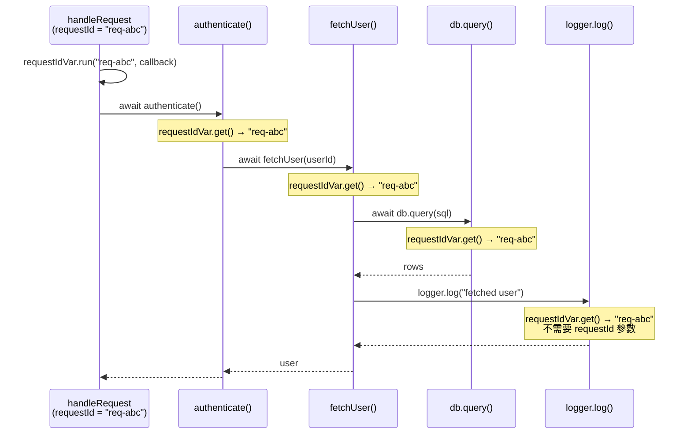

# [FEE-10006] Async Context — 跨非同步邊界傳播上下文

:::info
在請求處理函式頂端設定的請求識別碼，在深層巢狀的 `await` 呼叫日誌工具時已悄悄消失 — Async Context 在語言層級解決了這個問題。
:::

:::warning Web Platform Proposals
此提案目前位於 TC39 Stage 2。尚無任何瀏覽器實作。
先行技術：Node.js `AsyncLocalStorage`（Node 12.17+）。
在到達 Stage 4 之前，API 可能會變更。請查閱 TC39 提案儲存庫以取得最新狀態。
:::

## 背景

非同步 JavaScript 建立在事件迴圈之上：一個請求到達，處理函式觸發，一連串的 `await` 表達式在微任務檢查點之間暫停和恢復執行。每次暫停都會丟棄呼叫堆疊。等到執行恢復時 — 無論是在 `Promise.then()` 回呼、`setTimeout` 處理函式，或是巢狀的 `await` 中 — 執行環境都不會保留任何「是誰呼叫我」的環境資訊。

這為**橫切關注點（cross-cutting concerns）**製造了根本性的問題：某些資訊需要在整個非同步操作過程中保持可用，而不需要明確地作為函式參數傳遞。

### 三種變通方案 — 以及各自的失敗原因

**1. 將上下文作為函式參數傳遞（上下文穿透）**

最明確的方式：每個可能需要請求識別碼的函式都接受它作為參數。

```js
async function handleRequest(req, res) {
  const requestId = req.headers['x-request-id'];
  const user = await authenticate(requestId);        // 向下傳遞
  const profile = await fetchProfile(user.id, requestId); // 繼續傳遞
  await updateCache(profile, requestId);             // 再傳遞
  logger.log('done', { requestId });                 // 終於在這裡使用
}
```

這雖然可行，但具有**病毒性**：每個中間函式都必須接受並轉發 `requestId`，即使它本身並不使用這個值。如果要新增一個橫切關注點（例如租戶 ID、語系設定），每個呼叫鏈中的每個函式簽名都要跟著增長。

**2. 模組層級全域變數**

將當前請求識別碼存儲在模組層級的變數中。

```js
// logger.js
let currentRequestId = null;

export function setRequestId(id) { currentRequestId = id; }
export function log(msg) { console.log(`[${currentRequestId}] ${msg}`); }
```

在單執行緒、單一請求的情境下這能運作。但**一旦有並行請求就立刻崩壞**：如果兩個請求同時執行（兩者都在等待某些操作），它們共享同一個 `currentRequestId` 變數。請求 B 的 `setRequestId()` 呼叫會在請求 A 執行途中覆蓋掉 A 的值。

**3. Node.js `AsyncLocalStorage`**

Node.js 在 12.17 版（2020 年）引入了 `AsyncLocalStorage` 作為生產環境可用的解決方案。它儲存一個值，該值會自動傳播到當前上下文衍生的所有非同步操作中 — `await`、`Promise.then()`、`setTimeout`、`setImmediate` 等等。

```js
import { AsyncLocalStorage } from 'node:async_hooks';

const store = new AsyncLocalStorage();

async function handleRequest(req, res) {
  store.run({ requestId: req.headers['x-request-id'] }, async () => {
    await authenticate();
    await fetchProfile();
    logger.log('done'); // 可呼叫 store.getStore() 讀取 requestId
  });
}
```

`AsyncLocalStorage` 完整地解決了這個問題 — 但**僅限 Node.js**。在瀏覽器、Web Workers 或其他 JavaScript 執行環境中沒有等效的 API。OpenTelemetry 的瀏覽器 SDK 無法使用它。Deno 需要自己的填充實作。邊緣執行環境（Cloudflare Workers、Vercel Edge）各自實作了自己的等效方案。

### 網頁可觀測性的缺口

OpenTelemetry 等分散式追蹤系統會為每個傳入請求分配一個**追蹤識別碼（trace ID）**，並為該請求中的每個工作單元分配一個**跨度識別碼（span ID）**。每一行日誌、每個對外的 fetch 呼叫、每次資料庫查詢都應該攜帶當前的追蹤和跨度識別碼，讓追蹤後端（Jaeger、Zipkin、Honeycomb）能夠重建完整的呼叫樹。

在 Node.js 中，OpenTelemetry 的 SDK 使用 `AsyncLocalStorage` 自動將活躍跨度傳播到所有非同步操作中。應用程式碼從不接觸追蹤識別碼 — 它只是執行 `await fetch(url)`，OpenTelemetry 的 instrumentation 會從非同步本地儲存中取得活躍跨度，並將 `traceparent` 標頭注入請求。

在瀏覽器中，這在今天是不可能的。沒有 `AsyncLocalStorage`。OpenTelemetry 的瀏覽器 SDK 只能退回到手動上下文傳遞，或根本無法跨非同步邊界傳播跨度。

**TC39 Async Context** 正是要將等同於 `AsyncLocalStorage` 的語意帶到所有 JavaScript 環境 — 瀏覽器、Node.js、Deno、Cloudflare Workers — 作為語言的一等特性。

## 情境

一個 SSR 網頁伺服器處理兩個並行請求。每個請求都需要一個唯一的 `requestId`，以便在集中式日誌系統中關聯其所有日誌行。

### 沒有 Async Context：兩種失敗模式

**失敗模式 1 — 模組層級全域變數（資料競爭）：**

```js
// logger.js — 對並行請求而言是破損的
let requestId = null;

export function setRequestId(id) { requestId = id; }
export function log(msg) { console.log(`[${requestId ?? 'no-id'}] ${msg}`); }
```

```js
// server.js
import { setRequestId, log } from './logger.js';

async function handleRequest(req) {
  setRequestId(req.headers['x-request-id']);
  log('request received');           // [req-A] request received
  await authenticate(req);           // 暫停 — req-B 在這裡執行
  // req-B 在我們等待期間呼叫了 setRequestId('req-B')
  log('auth complete');              // [req-B] auth complete  ← 錯誤
}

// 兩個並行請求
handleRequest({ headers: { 'x-request-id': 'req-A' } });
handleRequest({ headers: { 'x-request-id': 'req-B' } });
```

`await authenticate()` 的暫停讓事件迴圈有機會處理 `req-B`，後者覆寫了 `requestId`。`req-A` 恢復時，卻使用了 `req-B` 的識別碼記錄日誌。這是一個靜默的資料損毀錯誤 — 不會拋出任何例外。

**失敗模式 2 — 上下文穿透（病毒式參數）：**

```js
// 每個函式都必須接受 requestId — 即使它本身不直接使用
async function handleRequest(req) {
  const requestId = req.headers['x-request-id'];
  await authenticate(req, requestId);
}

async function authenticate(req, requestId) {
  const user = await fetchUser(req.userId, requestId); // 必須轉發
  return user;
}

async function fetchUser(userId, requestId) {
  const row = await db.query('SELECT * FROM users WHERE id = ?', userId, requestId); // 再次轉發
  log('fetched user', requestId); // 終於在這裡使用
  return row;
}

async function log(msg, requestId) {
  console.log(`[${requestId}] ${msg}`); // 實際使用點
}
```

`requestId` 出現在四個函式簽名中，只為了到達日誌呼叫。再加入第二個橫切關注點（`tenantId`、`locale`、`traceSpan`），每個簽名就又會增長。

### 使用 Async Context：乾淨的傳播

```js
// context.js — 只定義一次變數
import { AsyncContext } from 'async-context-polyfill'; // 提案 API

export const requestIdVar = new AsyncContext.Variable({
  name: 'requestId',
  defaultValue: 'no-request-id',
});
```

```js
// server.js — 只在進入點設定一次值
import { requestIdVar } from './context.js';

async function handleRequest(req) {
  requestIdVar.run(req.headers['x-request-id'], async () => {
    await authenticate(req); // 不需要 requestId 參數
    await fetchProfile(req);
    log('request complete'); // 不需要 requestId 參數
  });
}
```

```js
// logger.js — 在非同步鏈的任何地方讀取值
import { requestIdVar } from './context.js';

function log(msg) {
  const requestId = requestIdVar.get(); // 永遠正確，即使在 await 之後
  console.log(`[${requestId}] ${msg}`);
}
```

```js
// db.js — 同樣能正確讀取，零參數變更
import { requestIdVar } from './context.js';

async function query(sql) {
  const requestId = requestIdVar.get();
  console.log(`[${requestId}] db.query: ${sql}`);
  // ...
}
```

兩個並行請求各自擁有自己的 `requestId` 值，從 `.run()` 呼叫衍生的每個非同步操作都繼承該值。無需更改任何參數。沒有全域狀態競爭。

## 最佳實踐

**工程師應該將 `AsyncContext.Variable` 用於橫切環境資料** — 追蹤識別碼、請求識別碼、使用者會話權杖、語系設定、功能旗標 — 任何在邏輯上屬於「當前操作的上下文」而非特定函式直接輸入的資料。

**當將非同步工作傳遞給可能不會自動傳播上下文的第三方回呼時，工程師應該使用 `AsyncContext.Snapshot`**。事件監聽器、`setTimeout`、`requestAnimationFrame` 以及接受回呼的第三方 API，都在標準傳播鏈之外。用 `Snapshot` 包裝回呼，以捕獲當前上下文並在回呼觸發時恢復它。

```js
// 不使用 Snapshot — 上下文在事件監聽器回呼中遺失
element.addEventListener('click', async () => {
  // requestIdVar.get() 在這裡回傳預設值 — 上下文未傳播
  await doWork();
});

// 使用 Snapshot — 上下文被保留
const snapshot = new AsyncContext.Snapshot();
element.addEventListener('click', snapshot.wrap(async () => {
  // requestIdVar.get() 回傳建立 Snapshot 時當前的值
  await doWork();
}));
```

**不應使用 `AsyncContext.Variable` 取代明確函式參數，當資料是函式的直接、邏輯輸入時。** 需要 `userId` 才能計算結果的函式，應該接受 `userId` 作為參數。Async Context 是用於那些否則需要穿越許多對該值沒有語意興趣的中間層的資料。

**不應將 `AsyncContext.Variable` 用於應用程式狀態。** 它不是狀態管理解決方案。儲存在 `AsyncContext.Variable` 中的值的作用域限定於特定的非同步操作樹。一個分支中的變更不會向上或橫向傳播。將它用於環境資料，而非共享的可變狀態。

```js
// 錯誤 — 將 Async Context 用於應用程式狀態
const cartVar = new AsyncContext.Variable();
cartVar.run(new Cart(), async () => {
  await addItem('product-1');      // 在 run() 內部修改購物車
  // 購物車的變更在此 run() 作用域內可見
  // 但無法從外部存取 — 這令人困惑，並非實用用途
});

// 正確 — 用於環境資料
const traceIdVar = new AsyncContext.Variable({ name: 'traceId' });
traceIdVar.run(generateTraceId(), async () => {
  await processOrder(); // 追蹤識別碼流經所有 await
});
```

**在非同步操作的最外層邊界設定值** — 在請求處理函式、事件處理函式進入點，或任務排程器進入點。在呼叫鏈深處設定值會造成比預期更小的傳播作用域。

## 設計思維

### Node.js `AsyncLocalStorage`：久經考驗的先行技術

`AsyncLocalStorage` 在 Node.js 12.17.0（2020 年 5 月）中以 `async_hooks` 模組的形式引入，而底層的 `async_hooks` 自 Node.js 8 起就以實驗性 API 的形式存在，用於追蹤非同步操作。`AsyncLocalStorage` 將低層級的 async hooks 包裝成一個簡潔易用的 API。

到了 Node.js 16，`AsyncLocalStorage` 已變得穩定。主要的可觀測性工具立即採用了它：OpenTelemetry Node.js SDK、`cls-hooked`、`dd-trace`（Datadog APM）以及 `elastic-apm-node` 都以它作為上下文傳播的骨幹。

TC39 Async Context 提案明確以 `AsyncLocalStorage` 為藍本。語意是相同的：以一個值執行一個回呼，在該回呼內衍生的所有非同步操作（包括其後代，遞迴地）都繼承該值。差異在於 TC39 Async Context 是語言層級的標準，而非 Node.js 特有的 API。

Node.js 22 在實驗性旗標後加入了 `AsyncContext.Variable` 支援，作為 TC39 API 形狀的早期預覽。兩個 API 將會趨於一致。

### Zone.js：猴子補丁的前身

在 `AsyncLocalStorage` 出現之前，瀏覽器生態系中的主流解決方案是 Zone.js，自 AngularJS 2 起就被 Angular 使用。Zone.js 的工作原理是對瀏覽器中的每個非同步 API 進行猴子補丁：`setTimeout`、`setInterval`、`Promise`、`fetch`、`XMLHttpRequest`、`addEventListener`、`requestAnimationFrame` 等等。

當你在一個 Zone 內部時，你排程的任何非同步操作都攜帶了 Zone 的引用。當回呼觸發時，Zone.js 在呼叫回呼之前恢復 Zone 的上下文。

這雖然能運作，但有顯著的代價：
- **啟動開銷**：在載入時對數十個瀏覽器 API 進行猴子補丁
- **相容性風險**：Zone.js 不知道的任何非同步 API 都會打斷傳播鏈
- **套件大小**：Zone.js 為套件增加約 50KB
- **干擾開發工具**：被猴子補丁的 Promise 會讓某些瀏覽器分析器感到困惑

TC39 Async Context 是 Zone.js 所建構功能的原生、非猴子補丁版本。JavaScript 引擎原生地透過每種非同步機制傳播上下文，而不是從外部包裝每個非同步 API。無需補丁。不會遺漏 API。除上下文讀寫操作本身之外沒有額外開銷。

Angular 逐漸脫離 Zone.js 的遷移（由 Signals 提案和更廣泛的響應式架構重工驅動），部分動機在於預期 Async Context 最終將取代 Zone.js 的上下文傳播角色。

### OpenTelemetry：主要的生產使用案例

OpenTelemetry（OTel）是 CNCF 的分散式追蹤和可觀測性標準。其上下文傳播模型正是圍繞著 Async Context 所解決的問題建構的：

1. 一個傳入的 HTTP 請求攜帶包含追蹤識別碼和父跨度識別碼的 `traceparent` 標頭。
2. 伺服器為傳入請求建立一個新的跨度，並將活躍跨度存儲在上下文儲存中。
3. 每個對外的 fetch、資料庫呼叫和訊息佇列發布都從上下文儲存中讀取活躍跨度，並將其注入到對外請求的標頭中。
4. 下游服務繼續追蹤鏈。

在 Node.js 中，OTel 使用 `AsyncLocalStorage` 來完成步驟 2。請求期間發生的所有 `await` 操作都自動繼承活躍跨度。應用程式開發者不接觸追蹤識別碼。

在瀏覽器中，OTel 今天無法做到這一點。瀏覽器 SDK 必須使用全域變數（帶有並行請求競爭條件）或需要手動上下文傳遞。Async Context 將填補這個缺口，在瀏覽器發起的非同步操作樹中實現完整的分散式追蹤 — 包括單頁應用程式、Service Worker 和 Worklet。

### 「隱式上下文」與「動態作用域」— 計算機科學的淵源

Async Context 所解決的問題在程式語言理論中以多個名稱被廣泛研究：

**動態作用域**（相對於詞法作用域）：具有動態作用域的變數在建立它的呼叫的整個執行過程中可見，包括所有被呼叫者，無論詞法作用域如何。Lisp 的 special variables、Common Lisp 的帶有 `defvar` 的 `let`，以及 Scheme 的 `parameterize` 形式都是動態作用域機制。

**Scheme 的 `dynamic-wind`**：Scheme 的 `dynamic-wind` 保證了設置和清理過程在控制流進入和離開動態作用域時執行，即使透過 continuation。Async Context 透過 `await` 的傳播類似於在 continuation 邊界之間維護動態作用域。

**Haskell 的 `ReaderT` monad**：`ReaderT` 在不明確傳遞參數的情況下，將一個唯讀環境穿透一個計算。它是 Async Context 的純函數式等效物。環境透過 monadic bind（`>>=`）流動，就像 Async Context 透過 `await` 流動一樣。

這些概念在 Async Context 中匯聚：JavaScript 的 `await` 機制是 continuation 的一種形式，而透過它傳播上下文需要一個動態作用域機制 — 這正是 `AsyncContext.Variable` 所提供的。

### 與 React Context 的關聯

React 的 Context API（`React.createContext`、`useContext`）解決了相同的「隱式上下文」問題，但在元件樹的層級：

- **React Context**：隱式上下文作用域限定於 React 元件的子樹，透過渲染樹傳播
- **Async Context**：隱式上下文作用域限定於非同步操作的子樹，透過 `await` 鏈傳播

心智模型完全相同。領域不同。理解 `useContext` 的 React 開發者會發現 `AsyncContext.Variable` 立即直覺可用。

一個值得注意的差異：React Context 在消費者內部是唯讀的 — 你不能改變上下文值，只能透過 `<Context.Provider>` 向子樹提供新值。`AsyncContext.Variable` 同樣限定了變更的作用域：呼叫 `.run(newValue, fn)` 只影響在 `fn` 內衍生的非同步操作。變更不會向上或橫向傳播。

## 圖解

以下圖表展示了一個 HTTP 請求的非同步呼叫樹。`requestId` 值 `"req-abc"` 在請求處理函式中建立，並流經樹中的每個非同步操作 — 穿越 `await` 邊界，進入工具函式，無需作為參數傳遞。



呼叫樹中的每個節點都從根 `.run()` 呼叫繼承了 `requestId`。上下文值不是參數 — 它是由非同步執行上下文攜帶的環境資料。如果第二個請求以 `requestId = "req-xyz"` 同時執行，其整個非同步樹獨立地攜帶 `"req-xyz"`。

## 範例

### 1. 基本的 `AsyncContext.Variable` 用法

```js
// 使用 TC39 提案 API（填充函式庫或未來的原生支援）
// npm install async-context  (社群填充函式庫，僅供實驗)

const requestIdVar = new AsyncContext.Variable({
  name: 'requestId',
  defaultValue: 'unknown',
});

async function handleRequest(requestId) {
  // run() 為此非同步操作樹建立值
  await requestIdVar.run(requestId, async () => {
    await stepOne();
    await stepTwo();
  });
}

async function stepOne() {
  // 不需要 requestId 參數 — 從非同步上下文讀取
  const id = requestIdVar.get();
  console.log(`[stepOne] requestId = ${id}`);
  await stepOneHelper();
}

async function stepOneHelper() {
  // 同樣繼承 — 上下文流經每個巢狀的 await
  const id = requestIdVar.get();
  console.log(`[stepOneHelper] requestId = ${id}`);
}

async function stepTwo() {
  const id = requestIdVar.get();
  console.log(`[stepTwo] requestId = ${id}`);
}

// 兩個並行請求 — 各自有自己的上下文
handleRequest('req-abc');
handleRequest('req-xyz');

// 輸出（順序可能因非同步排程而有所不同）：
// [stepOne] requestId = req-abc
// [stepOne] requestId = req-xyz
// [stepOneHelper] requestId = req-abc
// [stepOneHelper] requestId = req-xyz
// [stepTwo] requestId = req-abc
// [stepTwo] requestId = req-xyz
```

每個請求的非同步樹攜帶自己的 `requestId`。這兩個值永不交叉。

### 2. `AsyncContext.Snapshot` — 在回呼中保留上下文

`AsyncContext.Snapshot` 在建立時捕獲當前的變數綁定。當將回呼傳遞給可能不會原生傳播上下文的 API 時使用它 — 事件監聽器、`setTimeout`、`requestAnimationFrame`、第三方排程器。

```js
const traceVar = new AsyncContext.Variable({ name: 'traceId' });

async function processJob(traceId) {
  await traceVar.run(traceId, async () => {
    console.log('start:', traceVar.get()); // traceId

    // 在將控制權交給 setTimeout 之前，立即捕獲上下文
    const snapshot = new AsyncContext.Snapshot();

    setTimeout(
      snapshot.wrap(() => {
        // 不使用 snapshot.wrap()，traceVar.get() 在這裡會回傳 'unknown'
        // 使用 snapshot.wrap()，它回傳 Snapshot 建立時捕獲的 traceId
        console.log('timeout callback:', traceVar.get()); // traceId — 正確
      }),
      100
    );

    // 對比 — 不使用 Snapshot：
    setTimeout(() => {
      console.log('without snapshot:', traceVar.get()); // 'unknown' — 上下文遺失
    }, 100);
  });
}

processJob('trace-789');
```

### 3. 多個變數 — 分層上下文

多個 `AsyncContext.Variable` 實例是獨立的。每個都在非同步樹中追蹤自己的值。

```js
const traceIdVar = new AsyncContext.Variable({ name: 'traceId', defaultValue: null });
const userIdVar = new AsyncContext.Variable({ name: 'userId', defaultValue: null });
const localeVar = new AsyncContext.Variable({ name: 'locale', defaultValue: 'en-US' });

function withRequestContext(traceId, userId, locale, fn) {
  return traceIdVar.run(traceId, () =>
    userIdVar.run(userId, () =>
      localeVar.run(locale, fn)
    )
  );
}

async function renderPage() {
  const traceId = traceIdVar.get();   // 'trace-001'
  const userId  = userIdVar.get();    // 'user-42'
  const locale  = localeVar.get();    // 'zh-TW'
  console.log({ traceId, userId, locale });
}

withRequestContext('trace-001', 'user-42', 'zh-TW', async () => {
  await renderPage(); // 正確讀取所有三個值
});
```

### 4. Node.js `AsyncLocalStorage` 等效寫法

在 Node.js 中今天使用相同用例（生產可用，不需要提案 API）：

```js
import { AsyncLocalStorage } from 'node:async_hooks';

const requestStore = new AsyncLocalStorage();

async function handleRequest(req, res) {
  const context = { requestId: req.headers['x-request-id'] };

  // run() 為以此為根的非同步樹建立儲存
  await requestStore.run(context, async () => {
    await authenticate(req);
    await fetchProfile(req);
    res.send('ok');
  });
}

function log(msg) {
  const ctx = requestStore.getStore(); // 在任何 await 之後永遠正確
  const requestId = ctx?.requestId ?? 'no-id';
  console.log(`[${requestId}] ${msg}`);
}

async function authenticate(req) {
  log('authenticating'); // 不需要參數即可讀取 requestId
  // ...
}

async function fetchProfile(req) {
  log('fetching profile'); // 不需要參數即可讀取 requestId
  // ...
}
```

`AsyncLocalStorage` API 形狀直接對應到 TC39 提案：

| Node.js `AsyncLocalStorage` | TC39 `AsyncContext.Variable` |
|-----------------------------|------------------------------|
| `new AsyncLocalStorage()` | `new AsyncContext.Variable({ name, defaultValue })` |
| `store.run(value, fn)` | `variable.run(value, fn)` |
| `store.getStore()` | `variable.get()` |
| `AsyncLocalStorage.snapshot()` | `new AsyncContext.Snapshot()` |

## 深入探討

### 上下文如何傳播：機制說明

`AsyncContext.Variable` 透過每種 JavaScript 非同步機制傳播：

- **`await`**：`await` 表達式處的活躍上下文在 Promise 解決並恢復執行時被還原。這是主要的傳播機制。
- **`Promise.then(fn)` / `Promise.catch(fn)` / `Promise.finally(fn)`**：`fn` 回呼繼承呼叫 `.then()` 時（而非 Promise 解決時）活躍的上下文。
- **`queueMicrotask(fn)`**：回呼繼承 `queueMicrotask()` 呼叫點處活躍的上下文。
- **`setTimeout(fn)` / `setInterval(fn)`**：回呼繼承 `setTimeout()` 呼叫點處的上下文。（這與 `AsyncLocalStorage` 的原始行為有所不同，TC39 提案標準化了一致的傳播行為。）
- **`new Promise(executor)`**：執行器繼承 `new Promise()` 呼叫點處的上下文。

### 什麼不會傳播

**`new Worker(url)`**：Web Workers 在隔離的全域作用域中執行。它們有自己的執行上下文。`AsyncContext.Variable` 的值**不會**跨越 Worker 邊界。如果你需要將上下文傳遞給 Worker，請序列化它並透過 `postMessage` 傳送。

**`structuredClone()` 和 `postMessage()`**：序列化機制會丟棄非同步上下文。`AsyncContext.Variable` 中的值不是結構化複製演算法的一部分。

### `AsyncContext.Variable` 預設值行為

在任何 `.run()` 呼叫之外呼叫 `.get()` 時，會回傳建構子中提供的 `defaultValue`：

```js
const traceVar = new AsyncContext.Variable({
  name: 'traceId',
  defaultValue: 'no-trace',
});

// 在任何 run() 之外：
console.log(traceVar.get()); // 'no-trace'

traceVar.run('trace-abc', () => {
  console.log(traceVar.get()); // 'trace-abc'
});

// run() 完成後：
console.log(traceVar.get()); // 'no-trace' — 回到預設值
```

沒有 `defaultValue` 時，在 `.run()` 呼叫之外，`.get()` 回傳 `undefined`。請始終提供 `defaultValue`，或在消費者中防範 `undefined`。

### `AsyncContext.Snapshot` 內部機制

`new AsyncContext.Snapshot()` 在建立快照的時刻，捕獲**所有當前 `AsyncContext.Variable` 綁定的完整集合** — 不是作為值的副本，而是綁定映射。這意味著：

- 在快照建立時所有有活躍值的變數都被捕獲。
- 在 `new Snapshot()` 之後新增的變數不在快照中。
- 快照不追蹤變更：如果一個變數的值在快照建立後發生了變更，快照仍持有快照建立時的值。

```js
const v = new AsyncContext.Variable({ defaultValue: 'initial' });

v.run('first', () => {
  const snapshot = new AsyncContext.Snapshot(); // 捕獲 'first'

  v.run('second', () => {
    console.log(v.get()); // 'second' — 在第二個 run 內部

    snapshot.run(() => {
      console.log(v.get()); // 'first' — 快照還原了 'first'
    });

    console.log(v.get()); // 'second' — 回到第二個 run 的值
  });
});
```

`snapshot.wrap(fn)` 是 `(...args) => snapshot.run(() => fn(...args))` 的簡寫。

### 與結構化並行的互動

TC39 也在探索結構化並行提案。Async Context 與結構化並行之間的互動是一個活躍的設計領域：當一個「作用域」（結構化並行原語）分叉子任務時，這些子任務是否繼承父作用域的非同步上下文？目前的預期是肯定的 — 子任務從其父作用域繼承上下文，與今天 `await` 傳播上下文的方式一致。

### 為什麼 Stage 2 需要更長時間：瀏覽器整合的挑戰

從 Stage 2 進展到 Stage 3 需要完整的規格說明。對於 Async Context，規格必須精確定義上下文如何透過以下途徑傳播：

- HTML 規格中所有現有的非同步原語（`setTimeout`、事件監聽器、微任務佇列）
- 未來新增的非同步 API（它們需要明確說明上下文傳播行為）
- 擴充 JavaScript 引擎的宿主環境（瀏覽器、Node.js、Deno、Cloudflare Workers）

這種橫切性質 — 提案必須延伸到 HTML 規格，而不僅僅是 ECMA-262 — 是為什麼 Stage 2 的工作需要大量時間。提案的主要推動者正在與瀏覽器廠商（尤其是 Chrome/V8 和 Firefox/SpiderMonkey）合作，就實作策略達成共識。

## 內部參考

- [FEE-301 — 事件迴圈](../../JavaScript%20Core%20and%20Runtime/301.md) — 上下文流經的非同步模型；理解微任務和任務佇列是先備知識
- [FEE-403 — Fetch 與網路](../../Web%20APIs%20and%20Browser%20Platform/403.md) — 在對外 fetch 請求中傳播追蹤識別碼；主要的 OTel 使用案例
- [FEE-10002 — 顯式資源管理](10002.md) — 另一個在 TC39 標準化的非同步原語；兩個提案都涉及非同步生命週期問題
- [FEE-1400 — 可觀測性](../../Engineering%20Excellence/1400.md) — Async Context 的主要生產使用案例；分散式追蹤與日誌關聯

## 參考資料

- [TC39 proposal-async-context](https://github.com/tc39/proposal-async-context) — 官方提案儲存庫；包含規格說明、設計原理、API 參考和委員會討論歷史
- [Node.js AsyncLocalStorage 文件](https://nodejs.org/api/async_context.html) — 生產可用的先行技術；相同的語意，Node.js 特有的 API
- [OpenTelemetry JavaScript SDK — 上下文傳播](https://opentelemetry.io/docs/languages/js/context/) — 在分散式追蹤傳播中實際使用 AsyncLocalStorage；TC39 提案的主要動機
- [Zone.js README](https://github.com/angular/angular/tree/main/packages/zone.js) — 猴子補丁的前身；記錄了非同步上下文問題和 Zone.js 的解決方案
- [TC39 提案 — Stage 2](https://github.com/tc39/proposals) — 所有活躍 TC39 提案的當前階段狀態
- [Node.js async_hooks 文件](https://nodejs.org/api/async_hooks.html) — `AsyncLocalStorage` 底層的低層級 API；有助於理解 Node.js 實作歷史
