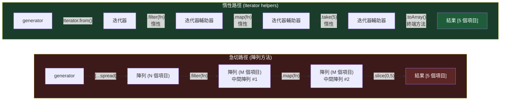

# [FEE-10100] Iterator Helpers — 迭代器的 `.map()`、`.filter()`、`.take()`

:::info
你現在可以直接在任何迭代器上串接 `.map()`、`.filter()`、`.take()` — 不需要中間陣列、不需要函式庫，也不需要急切求值。
:::

:::tip Web Platform Proposals
此提案已達 TC39 Stage 4，並作為 ECMAScript 2025 的一部分正式發布。
可用於 Chrome 122+、Firefox 131+、Safari 18.4+。Iterator Helpers 自 2025 年 3 月起成為 Baseline Newly Available。
請查閱 MDN 以取得最新相容性表格。
:::

## 背景

JavaScript 對可迭代物件（iterable）的組合處理一直存在問題。陣列擁有豐富的轉換方法 — `.map()`、`.filter()`、`.reduce()` — 但這些方法只適用於陣列。其他任何可迭代物件（`Set`、`Map`、generator、`NodeList`）都必須先被具象化為陣列，才能進行任何有意義的操作。

### 三個核心問題

**1. 強制急切求值（eager materialization）。** 如果你有一個裝有使用者 ID 的 `Set`，想要對其進行映射，你無法直接呼叫 `.map()`。你必須先展開它：

```js
const ids = new Set([1, 2, 3, 4, 5]);

// 這行不通 — Set 沒有 .map()
ids.map(id => fetchUser(id)); // TypeError

// 必須先具象化
[...ids].map(id => fetchUser(id));
```

展開操作會建立一個完整的中間陣列，即使你只需要第一個結果也一樣。

**2. 中間陣列不斷累積。** 在陣列上串接 `.filter()` 和 `.map()` 會建立兩個獨立的中間陣列。對於大型資料集而言，這是一種浪費：

```js
const result = largeArray
  .filter(x => x.active)   // 中間陣列 #1
  .map(x => x.name)        // 中間陣列 #2
  .slice(0, 10);            // 最終結果
```

三次資料遍歷、三次記憶體配置。最後的 `.slice(0, 10)` 讓所有針對第 11 項以後元素所做的工作都付諸流水。

**3. Generator 沒有組合工具。** Generator 函式是表達惰性序列的強大工具，但它們實作的迭代器協定（iterator protocol）沒有任何內建的輔助方法。一個能 yield 一萬個項目的 generator 沒有 `.filter()`、沒有 `.take()`，什麼都沒有：

```js
function* naturals() {
  let n = 0;
  while (true) yield n++;
}

// 要取得前 5 個偶數，必須手動撰寫迴圈
function firstFiveEvens() {
  const result = [];
  for (const n of naturals()) {
    if (n % 2 === 0) result.push(n);
    if (result.length === 5) break;
  }
  return result;
}
```

這正是那種消耗生產力的樣板程式碼。Lodash、Ramda 等函式庫長期以來填補了這個空缺 — Lodash 的 `_.chain()` 是廣為人知的變通方案 — 但它們需要執行期依賴，且只能操作陣列，而非迭代器。

**4. 無限序列在實務上難以使用。** 因為沒有辦法說「在取得 5 個結果後停止」，擁有無限 generator 的開發者要麼被迫手動收集成一個大型的有限陣列，要麼每次都從頭撰寫提前退出的迴圈。

Iterator helpers 一次解決了這四個問題。

## 情境

你的團隊從 API 接收大型分頁資料集。一位資深工程師撰寫了一個 generator，以惰性方式逐筆 yield 資料，而非一次拉取所有分頁：

```js
async function* fetchRecords(endpoint) {
  let cursor = null;
  do {
    const resp = await fetch(`${endpoint}?cursor=${cursor ?? ''}`);
    const page = await resp.json();
    for (const record of page.items) yield record;
    cursor = page.nextCursor;
  } while (cursor);
}
```

你需要從這個資料流中找到前 10 位活躍的付費用戶。沒有 iterator helpers，你只有兩個糟糕的選擇：

```js
// 選項 A：先收集全部 — 完全抵消了 generator 的意義
const allRecords = [];
for await (const r of fetchRecords('/users')) allRecords.push(r);
const result = allRecords
  .filter(r => r.active && r.plan === 'premium')
  .slice(0, 10);

// 選項 B：每次都手動撰寫迴圈樣板
const result = [];
for await (const r of fetchRecords('/users')) {
  if (r.active && r.plan === 'premium') result.push(r);
  if (result.length === 10) break;
}
```

有了同步版 iterator helpers（非同步版也將推出），這變成一個簡潔的單一鏈式呼叫：

```js
// 乾淨、惰性、可讀 — 一旦有 10 個結果就停止
const result = Iterator.from(fetchRecords('/users'))
  .filter(r => r.active && r.plan === 'premium')
  .take(10)
  .toArray();
```

沒有中間陣列，沒有手動的 `break`，意圖一目了然。

## 最佳實踐

**工程師應在任何急切終端方法之前串接 iterator helpers，以避免中間陣列。** 惰性輔助方法（`.map()`、`.filter()`、`.take()`、`.drop()`、`.flatMap()`）會回傳新的迭代器物件 — 在終端方法消費整個鏈之前，不會執行任何工作。

```js
// 正確：所有轉換都是惰性的，最後才有一個終端方法
const result = Iterator.from(data)
  .filter(x => x.active)
  .map(x => x.name)
  .take(10)
  .toArray();

// 錯誤：中間的 .toArray() 破壞了惰性求值
const names = Iterator.from(data)
  .filter(x => x.active)
  .toArray()             // 急切求值 — 在此具象化
  .map(x => x.name)     // 現在操作的是陣列，而非迭代器
  .slice(0, 10);
```

**工程師必須使用 `Iterator.from()` 才能在非陣列可迭代物件上使用輔助方法。** `Set`、`Map`、generator 結果和 `NodeList` 並不直接繼承自 `Iterator.prototype` — 先用 `Iterator.from()` 包裝它們：

```js
const set = new Set([1, 2, 3, 4, 5]);

// TypeError — Set.prototype 沒有 .filter()
set.filter(x => x > 2);

// 正確
Iterator.from(set).filter(x => x > 2).toArray(); // [3, 4, 5]
```

**在可能無限或非常大的 generator 上使用 `.take(n)` 作為安全閥。** 任何可以 yield 無限值的 generator，在以 `.toArray()` 或 `.reduce()` 結尾的鏈中都應包含 `.take(n)`。若沒有它，篩選條件中的一個 bug 可能導致消費者永遠掛起：

```js
// 危險：如果沒有值滿足篩選條件，這永遠不會結束
Iterator.from(infiniteSource()).filter(isRare).toArray();

// 安全：保證會停止
Iterator.from(infiniteSource()).filter(isRare).take(100).toArray();
```

**迭代器是一次性使用的。** 迭代器一旦被消費（全部或部分），就會耗盡。你無法倒回或再次迭代。如果需要多次迭代相同的資料，每次呼叫工廠函式以取得新的迭代器：

```js
const iter = Iterator.from(mySet);
iter.take(3).toArray(); // [a, b, c]
iter.take(3).toArray(); // [] — 迭代器已耗盡

// 正確：每次建立新的迭代器
const fresh = () => Iterator.from(mySet);
fresh().take(3).toArray(); // [a, b, c]
fresh().take(3).toArray(); // [a, b, c]
```

**當只需要檢查或取得單一元素時，優先使用 `.find()` 或 `.some()`，而非 `.filter().toArray()[0]`** — 它們在找到第一個符合項目時即短路，不會消費迭代器的其餘部分。

## 設計思維

### 惰性求值在其他語言是標準，在 JS 陣列卻例外

大多數現代語言預設將迭代視為惰性的。Python 內建的 `map()` 和 `filter()` 回傳惰性 generator — 在你迭代結果之前不會執行任何工作。Haskell 的串列（list）在構造上就是惰性的：無限串列 `[1..]` 完全合法，因為在被消費之前不會進行任何求值。Rust 的迭代器轉接器（`.map()`、`.filter()`、`.take_while()`）以零成本著稱：編譯器會將整個鏈融合成單一緊湊的迴圈。

JavaScript 採取了相反的方式。ES5 引入的陣列方法是為那個「瀏覽器中的大型資料」還不是真實問題的年代設計的，針對記憶體中的小型集合。這些方法是急切的：在回傳之前，每個元素都會被轉換。ES6 加入了 `Symbol.iterator` 協定，但只是底層協定 — 沒有隨之帶來高層的輔助方法。

結果：兩個平行的宇宙。陣列有豐富的方法庫；其他一切什麼都沒有。Iterator helpers 弭平了這道鴻溝。

### Lodash 的 `_.chain()` 是 userland 的解答

Lodash 的 `_.chain()` 十多年來一直是廣泛使用的變通方案：

```js
import _ from 'lodash';

const result = _.chain([1, 2, 3, 4, 5, 6, 7, 8, 9, 10])
  .filter(n => n % 2 === 0)
  .map(n => n * n)
  .take(3)
  .value(); // [4, 16, 36]
```

`_.chain()` 將陣列包裝在一個惰性包裝器中，延遲執行直到 `.value()` 被呼叫。這在功能上與 iterator helpers 相似 — 差別在於它仍然操作陣列，而非迭代器協定本身，因此無法原生消費 generator 或非陣列可迭代物件。Iterator helpers 是這個模式的原生協定層版本。

### 無限序列現在切實可行

在 iterator helpers 出現之前，無限序列是一個概念工具 — 對於解釋 generator 很有用，但在實際程式碼中使用起來很笨拙。現在，開發者可以將「給我自然數中前 N 個偶數的平方」表達為直接的管道：

```js
function* naturals() {
  let n = 0;
  while (true) yield n++;
}

// 前 5 個偶數平方 — 讀起來像規格說明
Iterator.from(naturals())
  .map(n => n * n)
  .filter(n => n % 2 === 0)
  .take(5)
  .toArray(); // [0, 4, 16, 36, 64]
```

Generator 從不產生無限序列。每一步一次拉取一個值：`.take(5)` 請求 5 個，`.filter()` 從 `.map()` 拉取直到 5 個通過，`.map()` 從 `naturals()` 一次拉取一個值。沒有任何東西被提前具象化。

### 為什麼陣列保持急切求值

將 `Array.prototype.map()` 改為回傳惰性迭代器會破壞 Web。數以千計的程式碼庫依賴 `Array.prototype.map()` 立即回傳一個真實陣列。TC39 委員會明確選擇在 `Iterator.prototype` 上新增輔助方法，而非改變 `Array.prototype`，讓陣列行為保持不變。這與給我們帶來 `const`/`let` 而非改變 `var` 的向後相容性原則如出一轍。

## 圖解



急切路徑無論你需要多少結果都會建立三個中間陣列。惰性路徑一次拉取一個值 — 一旦 `.take(5)` 收集到 5 個項目，generator 就不會再被呼叫。

## 範例

### 1. 帶有惰性篩選的無限費波那契數列

```js
function* fibonacci() {
  let [a, b] = [0, 1];
  while (true) {
    yield a;
    [a, b] = [b, a + b];
  }
}

// 前 5 個偶數費波那契數
const result = Iterator.from(fibonacci())
  .filter(n => n % 2 === 0)
  .take(5)
  .toArray();

console.log(result); // [0, 2, 8, 34, 144]
```

Generator 無限地 yield 值；`.take(5)` 確保在收集到 5 個偶數後停止。

### 2. 使用 `Iterator.from(Set)` 去重並轉換

```js
const raw = new Set([1, 2, 3, 2, 1, 4, 5]);

const doubled = Iterator.from(raw)
  .map(x => x * 2)
  .toArray();

console.log(doubled); // [2, 4, 6, 8, 10]
```

`Iterator.from()` 包裝了 `Set` — 它在構造上就已去重 — 並賦予其完整的 iterator helper API。

### 3. 映射 Map 的條目

```js
const scores = new Map([
  ['Alice', 92],
  ['Bob', 78],
  ['Carol', 85],
]);

const passing = Iterator.from(scores)
  .filter(([, score]) => score >= 80)
  .map(([name, score]) => `${name}: ${score}`)
  .toArray();

console.log(passing); // ["Alice: 92", "Carol: 85"]
```

### 4. Lodash 對比範例

Lodash `_.chain()` 模式的並排對比：

```js
// Lodash — 基於陣列，需要依賴套件
import _ from 'lodash';

const lodashResult = _.chain([1, 2, 3, 4, 5, 6, 7, 8, 9, 10])
  .filter(n => n % 2 === 0)
  .map(n => n * n)
  .take(3)
  .value();
// [4, 16, 36]

// Iterator helpers — 原生，適用於任何可迭代物件
function* nums() { let n = 1; while (true) yield n++; }

const nativeResult = Iterator.from(nums())
  .filter(n => n % 2 === 0)
  .map(n => n * n)
  .take(3)
  .toArray();
// [4, 16, 36]
```

Iterator helpers 版本適用於無限序列（infinite sequence）；Lodash 版本需要一個有限陣列作為起點。

### 5. 使用 `.find()` 和 `.some()` 提前退出

```js
const data = Iterator.from([10, 3, 7, 25, 2, 18]);

// 在第一個符合項目處短路 — 不會消費整個迭代器
const firstBig = data.find(n => n > 20);
console.log(firstBig); // 25

// 不收集就檢查是否存在
const hasTiny = Iterator.from([10, 3, 7, 25]).some(n => n < 5);
console.log(hasTiny); // true
```

## 深入探討

### 完整 API 參考

#### 惰性方法（回傳新的迭代器輔助器 — 尚未執行任何工作）

| 方法 | 說明 |
|------|------|
| `.map(mapperFn)` | 轉換每個值；一次一個地 yield 映射後的值 |
| `.filter(predicateFn)` | 跳過不符合條件的值 |
| `.take(limit)` | 在 yield `limit` 個值後停止 |
| `.drop(limit)` | 跳過前 `limit` 個值，yield 其餘的 |
| `.flatMap(mapperFn)` | 將每個值映射為可迭代物件，然後展開一層 |

**關於索引的說明：** 提案原本包含一個 `.indexed()` 方法，可將每個值與其索引配對。此方法最終未納入 ECMAScript 2025。如需加入索引，請使用外部計數器 — 與 `Array.prototype.map` 不同，迭代器的 `.map()` 只接收值，不接收索引：

```js
let i = 0;
const indexed = iterator.map(v => [i++, v]);
```

#### 急切方法（消費迭代器 — 觸發求值）

| 方法 | 說明 |
|------|------|
| `.toArray()` | 將所有剩餘值收集到一個 `Array` 中 |
| `.reduce(reducerFn, initialValue)` | 將值折疊成單一結果 |
| `.forEach(fn)` | 對每個值呼叫 `fn`；回傳 `undefined` |
| `.some(predicateFn)` | 如果任何值通過則回傳 `true`；短路 |
| `.every(predicateFn)` | 如果所有值通過則回傳 `true`；在第一次失敗時短路 |
| `.find(predicateFn)` | 回傳第一個通過的值；短路 |

#### 靜態方法

| 方法 | 說明 |
|------|------|
| `Iterator.from(iterableOrIterator)` | 包裝任何可迭代物件或迭代器，以存取 `Iterator.prototype` 的輔助方法 |

### `Iterator.from()` 的運作方式

`Iterator.from()` 會檢查其引數是否已繼承自 `Iterator.prototype`。如果是，則直接回傳它。如果不是，則建立一個薄包裝器，委派給底層迭代器的 `next()` 和 `return()` 方法。這意味著包裝的開銷極小，且原始迭代器的任何清理語義（例如 generator 的 `finally` 區塊）都會被保留：

```js
function* gen() {
  try {
    yield 1;
    yield 2;
    yield 3;
  } finally {
    console.log('已清理');
  }
}

// .take(1) 呼叫 iterator.return() 以發出提前終止信號
// generator 的 finally 區塊仍然會執行
Iterator.from(gen()).take(1).toArray();
// 輸出：「已清理」
// 回傳：[1]
```

### 繼承 `Iterator`

`Iterator` 類別被設計為可繼承的。如果你建立了一個具有自訂迭代器的自訂資料結構，可以讓它繼承自 `Iterator`，免費獲得所有輔助方法：

```js
class Range extends Iterator {
  #start; #end;
  constructor(start, end) {
    super();
    this.#start = start;
    this.#end = end;
  }
  next() {
    if (this.#start >= this.#end) return { done: true, value: undefined };
    return { done: false, value: this.#start++ };
  }
}

const range = new Range(1, 11);
range.filter(n => n % 2 === 0).toArray(); // [2, 4, 6, 8, 10]
```

### Polyfill

對於尚未支援 iterator helpers 的環境，有一個符合規格的 polyfill 可用：

```
npm install iterator-helpers-polyfill
```

或在 Babel 中使用 `useBuiltIns: 'usage'` 配置的 `core-js` polyfill。該 polyfill 會修補 `Iterator.prototype` 並加入 `Iterator.from()`。

### TC39 Stage 歷程

Iterator helpers 在 ECMAScript 2025（2025 年 6 月發布）定稿前達到 TC39 Stage 4，並作為該版本的一部分正式發布。該提案由 Michael Ficarra、Yulia Startsev、Lea Verou 等人共同提倡。它在 Stage 3 停留了數年，等待瀏覽器實作跟上。

## 內部參考

- [FEE-300 JavaScript Core & Runtime Overview](../../JavaScript%20Core%20and%20Runtime/300.md)
- [FEE-308 Generators & Iterators](../../JavaScript%20Core%20and%20Runtime/308.md)
- [FEE-10101 Set Methods](10101.md)

## 參考資料

- [TC39 proposal-iterator-helpers](https://github.com/tc39/proposal-iterator-helpers) — 提案儲存庫，包含規格文字與動機說明
- [MDN: Iterator](https://developer.mozilla.org/en-US/docs/Web/JavaScript/Reference/Global_Objects/Iterator) — 完整方法參考與瀏覽器相容性
- [V8 blog: Iterator helpers](https://v8.dev/features/iterator-helpers) — 來自 V8 團隊的實作說明與範例
- [web.dev: Iterator helpers Baseline 公告](https://web.dev/blog/baseline-iterator-helpers) — Baseline Newly Available 公告，2025 年 3 月
- [ECMAScript 2025 finalized — socket.dev](https://socket.dev/blog/ecmascript-2025-finalized) — Iterator helpers 與 Set Methods 納入 ES2025
- [LogRocket: Iterator helpers，ES2025 中最被低估的功能](https://blog.logrocket.com/iterator-helpers-es2025/) — 附範例的實務指南
