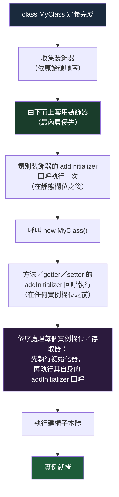

# [FEE-10300] Decorators — 類別、方法與欄位裝飾器

:::info
TC39 裝飾器定義了一套標準方式，用來標注並轉換類別、方法與欄位。目前它們僅能透過轉譯器執行——TypeScript 5.0+、Babel 或 esbuild——因為沒有瀏覽器原生支援；但它們取代了自 2015 年起框架所依賴的、彼此不相容的 `experimentalDecorators` 系統。
:::

:::warning Web Platform Proposals
本提案截至 2026 年 7 月處於 TC39 Stage 2.7（先前自 2022 年 3 月起為 Stage 3；因瀏覽器實作停滯而被重新分類——引擎現況請參閱下方「今日如何執行裝飾器」）。
沒有瀏覽器原生支援裝飾器；目前的支援狀況請參閱 [caniuse.com/decorators](https://caniuse.com/decorators)。
TypeScript 5.0+ 透過轉譯，無需 `experimentalDecorators` 旗標即可支援 TC39 裝飾器。
最新狀態請參閱 [TC39 提案儲存庫](https://github.com/tc39/proposal-decorators)。
:::

:::danger 舊版 vs TC39 裝飾器 — 兩套互不相容的系統
**JavaScript 生態系中存在兩套完全不相容的裝飾器系統。本文僅介紹 TC39 標準（目前為 Stage 2.7）。**

| | 舊版 TypeScript 裝飾器 | TC39 裝飾器 |
|---|---|---|
| 啟用方式 | tsconfig 中設定 `"experimentalDecorators": true` | TypeScript 5.0+，無需任何旗標 |
| 規格依據 | 已廢棄的早期 TC39 提案（2015） | TC39 Stage 2.7（2022 年曾達到 Stage 3，於 2026 年 5 月重新分類）；僅能透過轉譯器使用，沒有原生執行環境 |
| Context 物件 | 原始描述符（`target`、`key`、`descriptor`） | 結構化 `context` 物件，包含 `kind`、`name`、`addInitializer`、`metadata` |
| 欄位裝飾器 | 在類別定義時執行一次；無法看到值 | 在定義時執行，`value` 為 `undefined`；可回傳一個初始化轉換函式 |
| 參數裝飾器 | 支援（供 DI 框架使用） | 標準中不存在——另有獨立提案 `tc39/proposal-class-method-parameter-decorators`，目前處於 Stage 1 |
| 元資料 | `Reflect.metadata`（獨立提案，從未標準化） | `Symbol.metadata`，來自配套的 Decorator Metadata 提案（Stage 2.7） |
| 使用者 | Angular（所有版本）、NestJS（所有版本）、TypeORM、MobX ≤5 | Lit 3+、MobX 6.11+、新的獨立函式庫 |

**在同一個專案中混用兩套系統會產生難以理解的 TypeScript 錯誤與執行階段錯誤。若你的 tsconfig 中有 `"experimentalDecorators": true`，你使用的並非 TC39 裝飾器。**

依賴注入機制建立在參數裝飾器與 `design:paramtypes` 元資料之上的框架（Angular、NestJS）目前無法機械式地遷移至 TC39 裝飾器——詳見下方「遷移指南」。
:::

## 背景

TC39 裝飾器提案最早於 2014 年提出（提案人：Yehuda Katz），歷經三次完整的重新設計後，於 2022 年 3 月達到 Stage 3——這場標準化工作至今已超過十二年。Python 在 2003 年加入了函式裝飾器，Java 在 2004 年引入了注解（annotations），C# 自 .NET 1.0 起便有屬性（attributes），Swift 則在 2019 年帶來了屬性包裝器（property wrappers）；JavaScript 的類別標注語法，比其中最早的那個晚了將近二十年才問世。

### 樣板程式碼問題

考慮幾乎所有嚴肅應用程式都會涉及的四個關注點：**日誌記錄**、**快取**、**輸入驗證**和**依賴注入**。這些關注點與它們所包裝的業務邏輯是正交的。把它們寫在行內會汙染業務邏輯；提取它們又需要手工撰寫包裝模式：

```js
// 沒有裝飾器：手動包裝日誌
class UserService {
  getUser(id) {
    console.log(`getUser called with ${id}`);
    const start = performance.now();
    const result = this._fetchUser(id);
    console.log(`getUser returned in ${performance.now() - start}ms`);
    return result;
  }
}
```

若同樣的模式要跨數十個方法重複，日誌關注點便會變得難以統一管理。

### TypeScript 的先行嘗試

TypeScript 在 2015 年根據一份非常早期的 TC39 提案加入了 `experimentalDecorators`。那份早期提案後來在大量重新設計的討論後被廢棄。TypeScript 的實作搶先進入了 Angular、NestJS 和 MobX 的生產環境，使這些框架都依賴於舊版行為。TC39 提案在 2022 年達到 Stage 3 之前，已完全重新設計，形成了更簡潔、更有原則的 API，與 TypeScript 實驗版**不相容**。

這個分歧造成了上方警告區塊中所記錄的兩套系統問題。

### TC39 設計所標準化的內容

規格定義了六種裝飾器類型：`class`（類別）、`method`（方法）、`getter`、`setter`、`field`（欄位）與 `accessor`（存取器），每種類型皆接收一個結構化的 **context 物件**，而非原始屬性描述符。context 物件提供了一致的介面：所裝飾元素的 `kind`（種類）、`name`（名稱）、是否為 `static` 或 `private`、用於每個實例設置的 `addInitializer` 鉤子，以及用於讀寫值的 `access` 物件。

### 高牆：DI 框架無法遷移

一位開發者加入了一個維護 Angular 應用程式的團隊。程式碼庫的 tsconfig 中有 `"experimentalDecorators": true`，並且全程使用 `@Component`、`@Injectable` 和 `@Input`。此時，一套新的工具函式庫（`@observability/trace`）以 TC39 風格的裝飾器提供服務方法追蹤功能。

開發者安裝函式庫後，對服務方法套用 `@trace`：

```ts
// tsconfig.json — 舊版設定仍然存在
{
  "compilerOptions": {
    "experimentalDecorators": true,   // <-- 問題所在
    "emitDecoratorMetadata": true
  }
}
```

```ts
import { trace } from '@observability/trace'; // TC39 風格裝飾器

@Injectable()
export class UserService {
  @trace()  // TypeScript 錯誤：Argument of type 'MethodDecorator' is not assignable...
  getUser(id: string) { ... }
}
```

TypeScript 回報不相容錯誤，原因是 `experimentalDecorators: true` 告訴編譯器預期舊版裝飾器簽名（接受 `target`、`key`、`descriptor`），但 `@trace` 匯出的是 TC39 風格的裝飾器，接受的是 `(value, context)`。

這並非版本落差的問題，也沒有升級路徑可以解決。Angular 的依賴注入透過舊版參數裝飾器與 `emitDecoratorMetadata` 的 `design:paramtypes` 來識別建構子參數——兩者皆沒有對應的標準版本（參數裝飾器由另一份獨立、處於 Stage 1 的提案 `tc39/proposal-class-method-parameter-decorators` 涵蓋）。Angular 官方 CLI 至今仍在工作區 tsconfig 範本中以 `"experimentalDecorators": true` 建立新專案；NestJS 出於相同原因處於同樣的處境。現實可行的作法是直接呼叫 `@observability/trace` 的純函式 API，或手動包裝該方法；目前沒有任何 Angular 版本將框架遷移至標準裝飾器。

### 今日如何執行裝飾器

本文中的每個程式碼範例都需要建置步驟；沒有任何一個範例能在瀏覽器或 Node 中未經轉譯就直接執行。截至 2026 年 7 月，轉譯器支援矩陣如下：

| 工具 | 最低版本 |
|---|---|
| TypeScript | 5.0+（無需 `experimentalDecorators` 旗標） |
| Babel | `@babel/plugin-proposal-decorators`，`version: "2023-11"` |
| esbuild | 0.21+ |
| SWC | 透過 `jsc.transform.decoratorVersion: "2022-03"` 支援 |

Deno 與 Bun（1.3.10+）以各自內建的 TypeScript 轉譯器轉譯標準裝飾器；Node 內建的型別剝除（type-stripping）與 `--experimental-transform-types` 則會直接拒絕裝飾器語法，因此在 Node 上需要外部轉譯器或載入器（tsx、ts-node，或一個建置步驟）。三者皆不原生執行裝飾器。

## 圖解



**套用順序細節：** 當同一個元素上疊加多個裝飾器時，它們由下而上套用（最靠近宣告的裝飾器最先執行）。這符合數學函式合成的慣例：`@A @B fn` 等同於 `A(B(fn))`。

```ts
class Example {
  @outer   // 第二個套用
  @inner   // 第一個套用
  method() {}
}
```

## 範例

### 1. `@logged` — 用於呼叫追蹤的方法裝飾器

```ts
function logged(value, context) {
  const methodName = String(context.name);

  return function (...args) {
    console.log(`[${methodName}] called with`, args);
    const result = value.call(this, ...args);
    console.log(`[${methodName}] returned`, result);
    return result;
  };
}

class Calculator {
  @logged
  add(a, b) {
    return a + b;
  }
}

const calc = new Calculator();
calc.add(2, 3);
// [add] called with [2, 3]
// [add] returned 5
```

裝飾器回傳一個包裝原始方法的新函式。`value.call(this, ...args)` 確保原始方法的 `this` 綁定不被破壞。

### 2. `@memoize` — 用於快取的方法裝飾器

```ts
function memoize(value, context) {
  const cache = new Map();

  return function (...args) {
    const key = JSON.stringify(args);
    if (cache.has(key)) {
      return cache.get(key);
    }
    const result = value.call(this, ...args);
    cache.set(key, result);
    return result;
  };
}

class MathService {
  @memoize
  fibonacci(n) {
    if (n <= 1) return n;
    return this.fibonacci(n - 1) + this.fibonacci(n - 2);
  }
}

const svc = new MathService();
svc.fibonacci(40); // 計算一次
svc.fibonacci(40); // 從快取回傳
```

注意：這個快取在所有實例之間共享，因為 `cache` 是在類別定義時於裝飾器閉包中捕獲的，而非每個實例各自擁有。若需要每個實例各自的快取，請使用 `addInitializer` 將 Map 儲存在實例上。

### 3. `@required` — 驗證每次賦值的存取器裝飾器

實例欄位的 `addInitializer` 回呼會在該欄位自身宣告的初始化器執行後立刻執行——也就是在建構子本體執行之前——因此它看不到建構子之後才賦予的值。若要驗證建構子所設定的值，應改為裝飾一個 `accessor` 欄位，並在回傳的 `set` 中檢查該值；這個 `set` 會在每次賦值時觸發，包括來自建構子的賦值：

```ts
function required(value, context) {
  const { get, set } = value;
  return {
    get() {
      return get.call(this);
    },
    set(newValue) {
      if (newValue === undefined || newValue === null) {
        throw new Error(
          `欄位 "${String(context.name)}" 為必填項，但其值為 ${newValue}`
        );
      }
      set.call(this, newValue);
    },
  };
}

class User {
  @required
  accessor name;

  @required
  accessor email;

  constructor(data) {
    this.name = data.name;   // 會經過上方產生的 setter
    this.email = data.email;
  }
}

new User({ name: 'Alice', email: 'alice@example.com' }); // OK
new User({ name: 'Bob', email: null }); // Error: 欄位 "email" 為必填項，但其值為 null
```

### 4. 裝飾器的 context 物件

每個裝飾器都會收到一個 `context` 物件作為第二個參數。完整結構如下：

```ts
interface DecoratorContext {
  kind: 'class' | 'method' | 'getter' | 'setter' | 'field' | 'accessor';
  name: string | symbol;
  static: boolean;
  private: boolean;
  access: {
    get?: (object) => unknown;   // 存在於 method、getter、field、accessor
    set?: (object, value) => void; // 存在於 setter、field、accessor
    has?: (object) => boolean;   // 存在於各種類型，不限於私有成員
  };
  addInitializer: (initializer: () => void) => void;
  metadata: Record<string | symbol, unknown>; // 在類別上所有裝飾器之間共享
}
```

```ts
function inspect(value, context) {
  console.log('kind:', context.kind);
  console.log('name:', context.name);
  console.log('static:', context.static);
  console.log('private:', context.private);
  return value; // 原樣回傳
}

class Demo {
  @inspect
  greet() {}

  @inspect
  static count = 0;
}
// kind: method, name: greet, static: false, private: false
// kind: field, name: count, static: true, private: false
```

## 最佳實踐

**工程師絕對不能在同一個專案中混用舊版 `experimentalDecorators` 和 TC39 裝飾器。** TypeScript 將發出令人困惑的錯誤，執行階段行為也將無法預期。選定一套系統並一致使用。

**將裝飾器用於橫切關注點**——日誌記錄、快取、驗證、依賴注入、序列化、存取控制、請求限速。這些正是裝飾器被設計來清晰表達的關注點。

```ts
class ProductService {
  @logged       // 橫切關注點：追蹤
  @memoize      // 橫切關注點：快取
  getProduct(id: string) {
    return this.db.find(id);
  }
}
```

**不要用裝飾器隱藏業務邏輯。** 一個被裝飾的類別或方法的本體，應當不需要了解裝飾器的實作就能完整閱讀。如果讀者必須理解 `@processOrder` 才能理解 `submitOrder()` 做了什麼，那麼這個裝飾器隱藏的是業務邏輯，而非橫切關注點。

```ts
// 不好的做法：裝飾器隱藏了核心業務邏輯
class OrderService {
  @processOrderAndSendEmailAndDeductInventory
  submitOrder(order: Order) {
    // 讀者無法在不了解裝飾器的情況下理解這個方法
  }
}

// 好的做法：裝飾器只處理橫切關注點
class OrderService {
  @transactional   // 基礎設施關注點：包裝在資料庫交易中
  submitOrder(order: Order) {
    this.inventory.deduct(order.items);
    this.email.sendConfirmation(order.customer);
    this.db.save(order);
  }
}
```

**將 `addInitializer` 用於實例啟動邏輯，而非驗證建構子之後才賦予的值。** 欄位裝飾器的 `value` 參數收到的是 `undefined`；`context.addInitializer` 會佇列一個回呼，在該欄位自身宣告的初始化器執行後立刻執行——也就是在建構子本體執行之前。這使它很適合用來將實例註冊到某處，或建立內部的 `Map`，但它執行得太早，看不到建構子之後才賦予的值。若要在每次賦值時（包括來自建構子的賦值）驗證或轉換值，應改為裝飾一個 `accessor` 欄位，並在回傳的 `set` 中拒絕不合法的值：

```ts
function required(value, context) {
  const { get, set } = value;
  return {
    get() {
      return get.call(this);
    },
    set(newValue) {
      if (newValue === undefined || newValue === null) {
        throw new Error(`欄位 "${String(context.name)}" 為必填項，但其值為 ${newValue}`);
      }
      set.call(this, newValue);
    },
  };
}
```

**在使用 TC39 裝飾器之前，務必確認你的 TypeScript 版本。** TypeScript 5.0+ 且不設定 `experimentalDecorators: true` 時，使用的是 TC39 裝飾器。TypeScript 4.x 搭配 `experimentalDecorators: true` 使用的是舊版系統。如果你的專案是在 2023 年之前建立的，請在新增裝飾器函式庫之前確認版本與設定。

## 設計思維

### 裝飾器跨語言的歷史

裝飾器模式在跨語言的發展上有著悠久的歷史：

- **Python（2003）** — 函式和類別上的 `@decorator` 語法。Python 裝飾器是普通的高階函式；這個語法純粹是 `fn = decorator(fn)` 的語法糖。
- **Java 注解（2004）** — 語言層面僅提供元資料，但 Spring、JUnit 等框架透過反射來使用它們。注解本身不在定義時轉換被注解的元素。
- **C# 屬性** — 與 Java 注解類似；工具和執行時期透過反射讀取的元資料。
- **Swift 屬性包裝器（2019）** — 編譯時機制，將儲存屬性包裝在泛型結構中，提供自訂的 get/set 行為。
- **TypeScript `experimentalDecorators`（2015）** — 基於後來被重新設計的 TC39 Stage 1 提案。這些裝飾器搶在規格穩定之前就進入了主要框架的生產環境。

TC39 的設計在精神上最接近 Python 裝飾器（裝飾器回傳一個替換或包裝後的版本），但加入了結構化的 context 物件，以便在無需反射的情況下提供更豐富的元資料。

### TC39 的重新設計歷程

最初的 TC39 裝飾器提案（提案人：Yehuda Katz，2014 年）以屬性描述符為基礎。在 2022 年 3 月達到 Stage 3 之前，該提案至少歷經了三次重大的重新設計：

- **v1（2014–2018）：** 以描述符為基礎，與 TypeScript 的實作相似。因與 `Reflect.metadata` 和類別欄位的互動問題而停滯。
- **v2（2018–2020）：** 「靜態裝飾器」——採用基於編譯時分析的全然不同方式。因限制性過強而被放棄。
- **v3（2020–2022）：** 以 context 物件為基礎。裝飾器接收結構化的 `context` 物件，而非原始描述符。`addInitializer` 提供每個實例的鉤子。`Symbol.metadata` 取代 `Reflect.metadata`。這正是達到 Stage 3 的版本，並在瀏覽器實作停滯後，於 2026 年 5 月被重新分類為 Stage 2.7（詳見「背景」中的「今日如何執行裝飾器」）。

這段歷經多年的重新設計歷程，說明了為何 TypeScript 2015 年的實作與最終設計有如此大的差異。

### 與舊版裝飾器的關鍵設計差異

最重要的行為差異在於**欄位裝飾器的執行時序**。舊版 TypeScript 屬性裝飾器僅在類別定義時執行一次，且只接收 `(target, key)`；裝飾器永遠看不到描述符或值，也不參與任何每個實例的初始化。TC39 欄位裝飾器同樣在類別定義時執行，但接收到的 `value` 為 `undefined`，並可回傳一個作用於欄位宣告初始值的初始化轉換函式。需要用到已建構實例的每個實例設置，則改由 `addInitializer` 處理——對於實例欄位、存取器、方法、getter 與 setter 裝飾器而言，它會在該成員自身的宣告步驟完成後立刻執行，且在建構子本體執行之前（完整順序請參閱「深入探討」）。

第二個關鍵差異是 **context 物件 vs. 原始描述符**。舊版裝飾器接受 `(target, key, descriptor)`——你必須檢查 `descriptor.value` 或 `descriptor.get` 才能知道自己在裝飾什麼。TC39 裝飾器接受 `(value, context)`，其中 `context.kind` 明確告訴你正在操作的對象。

## 深入探討

### 所有裝飾器類型與簽名

#### 方法裝飾器

```ts
function methodDecorator(value: Function, context: ClassMethodDecoratorContext) {
  // value：原始方法函式
  // 回傳：一個替換函式，或 undefined 保持原樣
  return function (...args) {
    return value.call(this, ...args);
  };
}
```

- `context.kind === 'method'`
- 回傳新函式以取代原始方法；回傳 `undefined`（或不回傳任何值）則保持不變。

#### 欄位裝飾器

```ts
function fieldDecorator(value: undefined, context: ClassFieldDecoratorContext) {
  // value：欄位裝飾器永遠為 undefined
  // 回傳：一個初始化函式，或 undefined
  return function (initialValue) {
    // 以欄位的初始值呼叫；回傳實際儲存的值
    return initialValue;
  };
}
```

- `context.kind === 'field'`
- 回傳一個接受初始值並回傳實際儲存值的函式——這是轉換初始值的方式。
- 對於需要完全初始化實例的副作用，使用 `context.addInitializer`。

#### 類別裝飾器

```ts
function classDecorator(value: typeof MyClass, context: ClassDecoratorContext) {
  // value：類別建構子本身
  // 回傳：一個替換類別，或 undefined
  return class extends value {
    extraMethod() { return 'added by decorator'; }
  };
}
```

- `context.kind === 'class'`
- 回傳新類別（通常繼承自原始類別）以取代它，或回傳 `undefined` 保持不變。

#### 存取器裝飾器（`accessor` 關鍵字）

`accessor` 關鍵字建立一個由私有插槽支援的自動存取器欄位，並附帶 getter 和 setter：

```ts
class Temperature {
  @logged
  accessor celsius = 0;
}
```

存取器裝飾器接收一個 `{ get, set }` 物件，並可回傳新的 `{ get, set }` 對：

```ts
function logged(value, context) {
  const { get, set } = value;
  return {
    get() {
      const v = get.call(this);
      console.log(`get ${String(context.name)}:`, v);
      return v;
    },
    set(v) {
      console.log(`set ${String(context.name)}:`, v);
      set.call(this, v);
    },
  };
}
```

#### Getter 與 Setter 裝飾器

```ts
class Box {
  #value = 0;

  @logged
  get value() { return this.#value; }

  @logged
  set value(v) { this.#value = v; }
}
```

- `context.kind === 'getter'` 或 `'setter'`
- 回傳新的 getter/setter 函式，或 `undefined`。

### `addInitializer(fn)`

`addInitializer` 可用於每一種裝飾器類型，但佇列的回呼**何時**執行取決於類型——其順序並非單一規則：

| 裝飾器類型 | 其 `addInitializer` 回呼的執行時機 |
|---|---|
| `class` | 執行一次，在類別完全定義完成、且靜態欄位初始化器執行完畢後。`this` 為該類別本身。 |
| `method` / `getter` / `setter`（實例） | 在建構期間、任何實例欄位初始化之前執行。`this` 為新建立的實例。 |
| `field` / `accessor`（實例） | 在建構期間，緊接在該特定欄位自身宣告的初始化器執行之後——依欄位逐一交錯執行，而非在最後統一批次執行。`this` 為新建立的實例。 |
| `method` / `getter` / `setter`（靜態） | 執行一次，於類別定義時、在靜態類別方法賦值完成之後，但在任何靜態欄位初始化器執行之前——並非依成員在原始碼中的位置。`this` 為該類別本身。 |
| `field` / `accessor`（靜態） | 執行一次，於類別定義時，緊接在該特定靜態欄位自身宣告的初始化器執行之後——依成員逐一交錯執行，順序依原始碼位置。`this` 為該類別本身。 |

實例的 method/getter/setter 先於欄位執行的順序，正是讓經典的 `@bound` 裝飾器得以運作的關鍵：它可以安全地註冊一個綁定方法的初始化器，並確保在任何欄位依賴該綁定方法存在之前就已執行完畢。

關鍵規則：
- 多次呼叫 `addInitializer` 會佇列多個回呼；它們依宣告順序執行。
- 在類別定義完成後不能再呼叫。

```ts
function register(value, context) {
  context.addInitializer(function () {
    // `this` 是新建立的實例
    Registry.register(this, context.name);
  });
}
```

### `Symbol.metadata`

`context.metadata` 與 `Symbol.metadata` 來自一份配套提案 `tc39/proposal-decorator-metadata`（同樣是 Stage 2.7），而非裝飾器提案本身——它取代了舊版系統中對 `Reflect.metadata` 的依賴。TypeScript 自 5.2 起才支援（並非 5.0）。目前尚無任何 JavaScript 引擎定義 `Symbol.metadata`，因此在引擎實作之前，讀取 `MyClass[Symbol.metadata]` 的程式碼需要 polyfill 這個 well-known symbol，例如：

```ts
(Symbol as any).metadata ??= Symbol.for('Symbol.metadata');
```

有了這個 polyfill（或 `core-js`）之後：套用於一個類別的所有裝飾器會共享同一個 `context.metadata` 物件，類別定義完成後，該物件會儲存在 `MyClass[Symbol.metadata]` 上。

```ts
function serialize(value, context) {
  // 儲存元資料供序列化函式庫日後使用
  context.metadata[context.name] = { serializable: true, type: 'string' };
}

class Person {
  @serialize
  name;

  @serialize
  email;
}

console.log(Person[Symbol.metadata]);
// { name: { serializable: true, type: 'string' },
//   email: { serializable: true, type: 'string' } }
```

## 遷移指南

### 從 `experimentalDecorators` 遷移

**哪些會改變：**

1. 從 tsconfig 中移除 `"experimentalDecorators": true` 和 `"emitDecoratorMetadata": true`。
2. 升級 TypeScript 至 5.0+（若需要 `Symbol.metadata` 則需 5.2+）。
3. 所有自訂裝飾器必須重寫：簽名從 `(target, key, descriptor)` 改為 `(value, context)`。
4. 提供舊版裝飾器的函式庫必須更新至提供 TC39 裝飾器的版本。
5. `Reflect.metadata` 的使用必須替換為 `Symbol.metadata`（並搭配 polyfill——詳見「深入探討」）。

**哪些保持不變：**

- `@decorator` 的呼叫端語法完全相同。
- 裝飾器仍然無法用於純物件字面量（TC39 版本僅適用於類別成員）。
- 疊加和合成的行為相同。

**完全無法遷移的部分：** 參數裝飾器。TC39 標準中沒有對應機制——另有一份獨立提案 `tc39/proposal-class-method-parameter-decorators`，目前仍處於 Stage 1。任何讀取建構子參數型別的裝飾器（依賴注入框架所仰賴的模式）目前都沒有機械式的遷移路徑可通往標準。

### 框架與函式庫現況（2026 年 7 月）

- **Angular** — 仍以 `experimentalDecorators: true` 產生新專案。一份[詢問標準裝飾器支援的功能請求](https://github.com/angular/angular/issues/56146)於 2024 年 5 月提出，並在 13 分鐘後被提出者本人自行關閉——原因是他發現全新的 Angular 專案即使不設定該旗標也能建置成功；但根本的落差依然存在：Angular 的依賴注入建立在建構子參數裝飾器之上，而標準中並不存在這個機制。
- **NestJS** — 與 Angular 處於相同處境，原因相同：其依賴注入容器仰賴參數裝飾器與 `emitDecoratorMetadata` 的 `design:paramtypes`。
- **Lit 3+** — 同時支援兩套系統。其[裝飾器文件](https://lit.dev/docs/components/decorators/)涵蓋了標準裝飾器的路徑（由於標準裝飾器無法改變類別成員的種類，因此需要搭配 `accessor` 關鍵字），但目前在正式環境中仍建議使用 `experimentalDecorators`，理由是編譯後的產出較小。
- **MobX 6.11+** — 已加入對標準裝飾器的支援；`@observable` 及相關 API 可用於 `accessor` 欄位，詳見 [MobX 裝飾器文件](https://mobx.js.org/enabling-decorators.html)。舊版裝飾器在 6.x 系列中仍受支援，但將於 MobX 7 中移除。

**TypeScript 相容性對照表：**

| TypeScript 版本 | `experimentalDecorators: true` | 無旗標 | 使用的裝飾器系統 |
|---|---|---|---|
| < 5.0 | 必要 | 不適用 | 僅舊版 |
| 5.0+ | 存在 | — | 舊版（旗標優先） |
| 5.0+ | 不存在 | — | TC39（Stage 2.7） |

## 延伸閱讀

- [FEE-303 原型與繼承](../../JavaScript%20Core%20and%20Runtime/303.md) — 裝飾器操作類別原型；理解原型鏈對方法裝飾器至關重要
- [FEE-300 JavaScript 核心概覽](../../JavaScript%20Core%20and%20Runtime/300.md) — 類別與物件模型的基礎背景

## 參考資料

- TC39, "proposal-decorators," GitHub. https://github.com/tc39/proposal-decorators
- TC39, "proposal-decorator-metadata," GitHub. https://github.com/tc39/proposal-decorator-metadata
- TC39, "ECMAScript proposals (stage tracking table)," GitHub tc39/proposals (2026). https://github.com/tc39/proposals
- Can I Use, "Decorators," caniuse.com (2026). https://caniuse.com/decorators
- Igalia, "Summary of the February 2025 TC39 plenary," Igalia Compilers Blog (2025). https://blogs.igalia.com/compilers/2025/03/27/summary-of-the-february-2025-tc39-plenary/
- Microsoft, "TypeScript 5.0," TypeScript release notes (2023). https://www.typescriptlang.org/docs/handbook/release-notes/typescript-5-0.html
- Microsoft, "TypeScript 5.2," TypeScript release notes (2023). https://www.typescriptlang.org/docs/handbook/release-notes/typescript-5-2.html
- Babel, "@babel/plugin-proposal-decorators," Babel documentation. https://babeljs.io/docs/babel-plugin-proposal-decorators
- Lit, "Decorators," lit.dev documentation. https://lit.dev/docs/components/decorators/
- MobX, "Enabling Decorators," mobx.js.org documentation. https://mobx.js.org/enabling-decorators.html
- Angular, Issue #56146 "Support for \"experimentalDecorators: false\" in TypeScript configuration file," GitHub (2024). https://github.com/angular/angular/issues/56146
- Axel Rauschmayer, "JavaScript metaprogramming with the 2022-03 decorators API," 2ality (2022). https://2ality.com/2022/10/javascript-decorators.html
- TC39, "Decorators to stage 2.7, per 2026.05.19 TC39," meeting notes, GitHub tc39/notes (2026). https://github.com/tc39/notes/blob/main/meetings/2026-05/may-19.md
