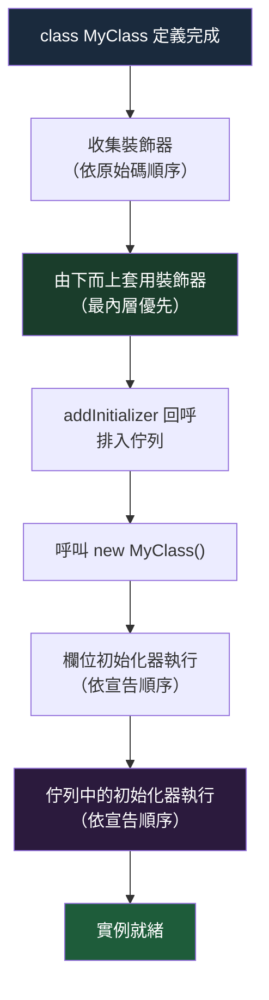

# [FEE-10300] Decorators — 類別、方法與欄位裝飾器

:::info
TC39 Stage 3 裝飾器為 JavaScript 提供了一套原生、符合標準的方式，用來標注並轉換類別、方法與欄位，消除了長期以來必須靠框架或轉譯器私有機制處理橫切關注點（cross-cutting concerns）的繁瑣樣板程式碼。
:::

:::warning Web Platform Proposals
本提案目前處於 TC39 Stage 3。已在 Chrome 130+、Firefox 133+ 中落地。
TypeScript 5.0+ 無需 `experimentalDecorators` 旗標即支援 TC39 裝飾器。
在進入 Stage 4 之前，API 介面仍可能有所調整。請參閱 MDN 與 TC39 提案儲存庫以獲取最新狀態。
:::

:::danger 舊版 vs TC39 裝飾器 — 兩套互不相容的系統
**JavaScript 生態系中存在兩套完全不相容的裝飾器系統。本文僅介紹 TC39 Stage 3 標準版本。**

| | 舊版 TypeScript 裝飾器 | TC39 Stage 3 裝飾器 |
|---|---|---|
| 啟用方式 | tsconfig 中設定 `"experimentalDecorators": true` | TypeScript 5.0+，無需任何旗標 |
| 規格依據 | 已廢棄的早期 TC39 提案（2015） | TC39 Stage 3（2022），已在瀏覽器中落地 |
| Context 物件 | 原始描述符（`target`、`key`、`descriptor`） | 結構化 `context` 物件，包含 `kind`、`name`、`addInitializer`、`metadata` |
| 欄位裝飾器 | 在欄位初始化器之後執行 | 在欄位初始化器之前執行；`value` 為 `undefined` |
| 元資料 | `Reflect.metadata`（獨立提案，從未標準化） | 類別上的 `Symbol.metadata` |
| 使用者 | Angular <18、NestJS <10、MobX 舊版 | Angular 18+、NestJS 10+、新版函式庫 |

**在同一個專案中混用兩套系統會產生難以理解的 TypeScript 錯誤與執行階段錯誤。若你的 tsconfig 中有 `"experimentalDecorators": true`，你使用的並非 TC39 裝飾器。**

遷移方式：從 tsconfig 中移除 `"experimentalDecorators": true`，升級至 TypeScript 5.0+，並遵照 Angular 18 / NestJS 遷移指南。
:::

## 背景

裝飾器是 JavaScript 歷史上需求最旺盛的功能之一。這個概念並非新鮮事：Python 在 2003 年加入了函式裝飾器，Java 在 2004 年引入了注解（annotations），C# 自 .NET 1.0 起便有屬性（attributes），Swift 則在 2019 年帶來了屬性包裝器（property wrappers）。幾乎所有主流語言生態系最終都需要一套機制，讓開發者能在不直接修改程式碼本身的情況下，對程式碼進行標注與轉換。

JavaScript 落後了。語言本身擁有原型操作、高階函式以及 Proxy，足以實現各種 meta-programming，但始終缺乏用於在類別上附加橫切關注點的一流語法。

### 樣板程式碼問題

考慮幾乎所有嚴肅應用程式都會涉及的四個關注點：**日誌記錄**、**快取**、**輸入驗證**和**依賴注入**。這些關注點與它們所包裝的業務邏輯是正交的。把它們寫在行內會汙染業務邏輯；提取它們又需要手工撰寫包裝模式：

```js
// 沒有裝飾器：手動包裝日誌
class UserService {
  getUser(id) {
    console.log(`getUser called with ${id}`);
    const start = performance.now();
    const result = this._fetchUser(id);
    console.log(`getUser returned in ${performance.now() - start}ms`);
    return result;
  }
}
```

若同樣的模式要跨數十個方法重複，日誌關注點便會變得難以統一管理。

### TypeScript 的先行嘗試

TypeScript 在 2015 年根據一份非常早期的 TC39 提案加入了 `experimentalDecorators`。那份早期提案後來在大量重新設計的討論後被廢棄。TypeScript 的實作搶先進入了 Angular、NestJS 和 MobX 的生產環境，使這些框架都依賴於舊版行為。TC39 提案在 2022 年達到 Stage 3 之前，已完全重新設計，形成了更簡潔、更有原則的 API，與 TypeScript 實驗版**不相容**。

這個分歧造成了上方警告區塊中所記錄的兩套系統問題。

### TC39 設計所標準化的內容

Stage 3 規格定義了五種裝飾器類型：`method`（方法）、`field`（欄位）、`class`（類別）、`accessor`（存取器）以及 `getter`/`setter`，每種類型皆接收一個結構化的 **context 物件**，而非原始屬性描述符。context 物件提供了一致的介面：所裝飾元素的 `kind`（種類）、`name`（名稱）、是否為 `static` 或 `private`、用於每個實例設置的 `addInitializer` 鉤子，以及用於讀寫值的 `access` 物件。

## 情境

一位開發者加入了一個維護 Angular 17 應用程式的團隊。程式碼庫的 tsconfig 中有 `"experimentalDecorators": true`，並且全程使用 `@Component`、`@Injectable` 和 `@Input`。此時，一套新的工具函式庫（`@observability/trace`）以 TC39 風格的裝飾器提供服務方法追蹤功能。

開發者安裝函式庫後，對服務方法套用 `@trace`：

```ts
// tsconfig.json — 舊版設定仍然存在
{
  "compilerOptions": {
    "experimentalDecorators": true,   // <-- 問題所在
    "emitDecoratorMetadata": true
  }
}
```

```ts
import { trace } from '@observability/trace'; // TC39 風格裝飾器

@Injectable()
export class UserService {
  @trace()  // TypeScript 錯誤：Argument of type 'MethodDecorator' is not assignable...
  getUser(id: string) { ... }
}
```

TypeScript 回報不相容錯誤，原因是 `experimentalDecorators: true` 告訴編譯器預期舊版裝飾器簽名（接受 `target`、`key`、`descriptor`），但 `@trace` 匯出的是 TC39 風格的裝飾器，接受的是 `(value, context)`。

**解決路徑：**

1. 確認 Angular 18 是否已發佈且可在本專案中使用（Angular 18+ 支援 TC39 裝飾器）。
2. 若專案尚無法遷移 Angular，改用其他追蹤方式——例如包裝函式，或等待該函式庫提供舊版相容的匯出版本。
3. 若要遷移至 Angular 18+：從 tsconfig 中移除 `experimentalDecorators` 和 `emitDecoratorMetadata`，升級 TypeScript 至 5.0+，並遵照 [Angular 18 遷移指南](https://angular.dev/guide/migrations/overview)。

**核心教訓：** 不要假設裝飾器與你的專案裝飾器系統相容。在使用任何裝飾器函式庫之前，請確認它所針對的是哪套系統。

## 最佳實踐

**工程師絕對不能在同一個專案中混用舊版 `experimentalDecorators` 和 TC39 裝飾器。** TypeScript 將發出令人困惑的錯誤，執行階段行為也將無法預期。選定一套系統並一致使用。

**將裝飾器用於橫切關注點**——日誌記錄、快取、驗證、依賴注入、序列化、存取控制、請求限速。這些正是裝飾器被設計來清晰表達的關注點。

```ts
class ProductService {
  @logged       // 橫切關注點：追蹤
  @memoize      // 橫切關注點：快取
  getProduct(id: string) {
    return this.db.find(id);
  }
}
```

**不要用裝飾器隱藏業務邏輯。** 一個被裝飾的類別或方法的本體，應當不需要了解裝飾器的實作就能完整閱讀。如果讀者必須理解 `@processOrder` 才能理解 `submitOrder()` 做了什麼，那麼這個裝飾器隱藏的是業務邏輯，而非橫切關注點。

```ts
// 不好的做法：裝飾器隱藏了核心業務邏輯
class OrderService {
  @processOrderAndSendEmailAndDeductInventory
  submitOrder(order: Order) {
    // 讀者無法在不了解裝飾器的情況下理解這個方法
  }
}

// 好的做法：裝飾器只處理橫切關注點
class OrderService {
  @transactional   // 基礎設施關注點：包裝在資料庫交易中
  submitOrder(order: Order) {
    this.inventory.deduct(order.items);
    this.email.sendConfirmation(order.customer);
    this.db.save(order);
  }
}
```

**欄位初始化的副作用應使用 `addInitializer`，而非嘗試直接修改欄位描述符。** 欄位裝飾器的 `value` 參數接收到的是 `undefined`（欄位在裝飾時尚無值）；每個實例的設置應透過 `context.addInitializer` 進行：

```ts
function required(value, context) {
  // 欄位裝飾器的 value 為 undefined — 不要在此處使用它
  context.addInitializer(function () {
    // `this` 為實例；在建構期間執行
    if (this[context.name] === undefined || this[context.name] === null) {
      throw new Error(`欄位 "${String(context.name)}" 為必填項`);
    }
  });
}
```

**在使用 TC39 裝飾器之前，務必確認你的 TypeScript 版本。** TypeScript 5.0+ 且不設定 `experimentalDecorators: true` 時，使用的是 TC39 裝飾器。TypeScript 4.x 搭配 `experimentalDecorators: true` 使用的是舊版系統。如果你的專案是在 2023 年之前建立的，請在新增裝飾器函式庫之前確認版本與設定。

## 設計思維

### 裝飾器跨語言的歷史

裝飾器模式在跨語言的發展上有著悠久的歷史：

- **Python（2003）** — 函式和類別上的 `@decorator` 語法。Python 裝飾器是普通的高階函式；這個語法純粹是 `fn = decorator(fn)` 的語法糖。
- **Java 注解（2004）** — 語言層面僅提供元資料，但 Spring、JUnit 等框架透過反射來使用它們。注解本身不在定義時轉換被注解的元素。
- **C# 屬性** — 與 Java 注解類似；工具和執行時期透過反射讀取的元資料。
- **Swift 屬性包裝器（2019）** — 編譯時機制，將儲存屬性包裝在泛型結構中，提供自訂的 get/set 行為。
- **TypeScript `experimentalDecorators`（2015）** — 基於後來被重新設計的 TC39 Stage 1 提案。這些裝飾器搶在規格穩定之前就進入了主要框架的生產環境。

TC39 Stage 3 的設計在精神上最接近 Python 裝飾器（裝飾器回傳一個替換或包裝後的版本），但加入了結構化的 context 物件，以便在無需反射的情況下提供更豐富的元資料。

### TC39 的重新設計歷程

最初的 TC39 裝飾器提案（提案人：Yehuda Katz，2014 年）以屬性描述符為基礎。在達到 2022 年的 Stage 3 之前，該提案歷經了至少三次重大重新設計，耗時八年：

- **v1（2014–2018）：** 以描述符為基礎，與 TypeScript 的實作相似。因與 `Reflect.metadata` 和類別欄位的互動問題而停滯。
- **v2（2018–2020）：** 「靜態裝飾器」——採用基於編譯時分析的全然不同方式。因限制性過強而被放棄。
- **v3（2020–2022，現行版）：** 以 context 物件為基礎。裝飾器接收結構化的 `context` 物件，而非原始描述符。欄位裝飾器在類別欄位初始化之前執行。`addInitializer` 提供每個實例的鉤子。`Symbol.metadata` 取代 `Reflect.metadata`。這是目前處於 Stage 3 的版本。

這段八年的歷程解釋了為何 TypeScript 2015 年的實作與最終設計有如此大的差異。

### 與舊版裝飾器的關鍵設計差異

最重要的行為差異在於**欄位裝飾器的執行時序**。在舊版 TypeScript 裝飾器中，欄位裝飾器在欄位初始化器之後執行。在 TC39 裝飾器中，欄位裝飾器在初始化器之前執行，且 `value` 參數永遠是 `undefined`（因為欄位此時尚無穩定的值）。這正是 `addInitializer` 存在的原因：它佇列了一個每個實例的回呼，在欄位初始化器賦值之後的建構期間執行。

第二個關鍵差異是 **context 物件 vs. 原始描述符**。舊版裝飾器接受 `(target, key, descriptor)`——你必須檢查 `descriptor.value` 或 `descriptor.get` 才能知道自己在裝飾什麼。TC39 裝飾器接受 `(value, context)`，其中 `context.kind` 明確告訴你正在操作的對象。

### 遷移路線

Angular 18 和 NestJS 10 都已遷移至 TC39 裝飾器。遷移並非易事，因為每個框架層級裝飾器的簽名都有所變更。對於 Angular，`ng update` 可處理機械性的變更，但第三方裝飾器函式庫可能需要更新或替換。

## 圖解



**套用順序細節：** 當同一個元素上疊加多個裝飾器時，它們由下而上套用（最靠近宣告的裝飾器最先執行）。這符合數學函式合成的慣例：`@A @B fn` 等同於 `A(B(fn))`。

```ts
class Example {
  @outer   // 第二個套用
  @inner   // 第一個套用
  method() {}
}
```

## 範例

### 1. `@logged` — 用於呼叫追蹤的方法裝飾器

```ts
function logged(value, context) {
  const methodName = String(context.name);

  return function (...args) {
    console.log(`[${methodName}] called with`, args);
    const result = value.call(this, ...args);
    console.log(`[${methodName}] returned`, result);
    return result;
  };
}

class Calculator {
  @logged
  add(a, b) {
    return a + b;
  }
}

const calc = new Calculator();
calc.add(2, 3);
// [add] called with [2, 3]
// [add] returned 5
```

裝飾器回傳一個包裝原始方法的新函式。`value.call(this, ...args)` 確保原始方法的 `this` 綁定不被破壞。

### 2. `@memoize` — 用於快取的方法裝飾器

```ts
function memoize(value, context) {
  const cache = new Map();

  return function (...args) {
    const key = JSON.stringify(args);
    if (cache.has(key)) {
      return cache.get(key);
    }
    const result = value.call(this, ...args);
    cache.set(key, result);
    return result;
  };
}

class MathService {
  @memoize
  fibonacci(n) {
    if (n <= 1) return n;
    return this.fibonacci(n - 1) + this.fibonacci(n - 2);
  }
}

const svc = new MathService();
svc.fibonacci(40); // 計算一次
svc.fibonacci(40); // 從快取回傳
```

注意：這個快取在所有實例之間共享，因為 `cache` 是在類別定義時於裝飾器閉包中捕獲的，而非每個實例各自擁有。若需要每個實例各自的快取，請使用 `addInitializer` 將 Map 儲存在實例上。

### 3. `@required` — 使用 `addInitializer` 的欄位裝飾器

```ts
function required(value, context) {
  // 欄位裝飾器的 value 為 undefined
  context.addInitializer(function () {
    const fieldValue = this[context.name];
    if (fieldValue === undefined || fieldValue === null) {
      throw new Error(
        `欄位 "${String(context.name)}" 為必填項，但其值為 ${fieldValue}`
      );
    }
  });
}

class User {
  @required
  name;

  @required
  email;

  constructor(data) {
    this.name = data.name;
    this.email = data.email;
    // addInitializer 的回呼在欄位賦值之後執行
  }
}

new User({ name: 'Alice', email: 'alice@example.com' }); // OK
new User({ name: 'Bob', email: null }); // Error: 欄位 "email" 為必填項，但其值為 null
```

### 4. 裝飾器的 context 物件

每個裝飾器都會收到一個 `context` 物件作為第二個參數。完整結構如下：

```ts
interface DecoratorContext {
  kind: 'class' | 'method' | 'getter' | 'setter' | 'field' | 'accessor';
  name: string | symbol;
  static: boolean;
  private: boolean;
  access: {
    get?: (object) => unknown;   // 存在於 method、getter、accessor
    set?: (object, value) => void; // 存在於 setter、accessor
    has?: (object) => boolean;   // 存在於私有欄位
  };
  addInitializer: (initializer: () => void) => void;
  metadata: Record<string | symbol, unknown>; // 在類別上所有裝飾器之間共享
}
```

```ts
function inspect(value, context) {
  console.log('kind:', context.kind);
  console.log('name:', context.name);
  console.log('static:', context.static);
  console.log('private:', context.private);
  return value; // 原樣回傳
}

class Demo {
  @inspect
  greet() {}

  @inspect
  static count = 0;
}
// kind: method, name: greet, static: false, private: false
// kind: field, name: count, static: true, private: false
```

## 深入探討

### 所有裝飾器類型與簽名

#### 方法裝飾器

```ts
function methodDecorator(value: Function, context: ClassMethodDecoratorContext) {
  // value：原始方法函式
  // 回傳：一個替換函式，或 undefined 保持原樣
  return function (...args) {
    return value.call(this, ...args);
  };
}
```

- `context.kind === 'method'`
- 回傳新函式以取代原始方法；回傳 `undefined`（或不回傳任何值）則保持不變。

#### 欄位裝飾器

```ts
function fieldDecorator(value: undefined, context: ClassFieldDecoratorContext) {
  // value：欄位裝飾器永遠為 undefined
  // 回傳：一個初始化函式，或 undefined
  return function (initialValue) {
    // 以欄位的初始值呼叫；回傳實際儲存的值
    return initialValue;
  };
}
```

- `context.kind === 'field'`
- 回傳一個接受初始值並回傳實際儲存值的函式——這是轉換初始值的方式。
- 對於需要完全初始化實例的副作用，使用 `context.addInitializer`。

#### 類別裝飾器

```ts
function classDecorator(value: typeof MyClass, context: ClassDecoratorContext) {
  // value：類別建構子本身
  // 回傳：一個替換類別，或 undefined
  return class extends value {
    extraMethod() { return 'added by decorator'; }
  };
}
```

- `context.kind === 'class'`
- 回傳新類別（通常繼承自原始類別）以取代它，或回傳 `undefined` 保持不變。

#### 存取器裝飾器（`accessor` 關鍵字）

`accessor` 關鍵字建立一個由私有插槽支援的自動存取器欄位，並附帶 getter 和 setter：

```ts
class Temperature {
  @logged
  accessor celsius = 0;
}
```

存取器裝飾器接收一個 `{ get, set }` 物件，並可回傳新的 `{ get, set }` 對：

```ts
function logged(value, context) {
  const { get, set } = value;
  return {
    get() {
      const v = get.call(this);
      console.log(`get ${String(context.name)}:`, v);
      return v;
    },
    set(v) {
      console.log(`set ${String(context.name)}:`, v);
      set.call(this, v);
    },
  };
}
```

#### Getter 與 Setter 裝飾器

```ts
class Box {
  #value = 0;

  @logged
  get value() { return this.#value; }

  @logged
  set value(v) { this.#value = v; }
}
```

- `context.kind === 'getter'` 或 `'setter'`
- 回傳新的 getter/setter 函式，或 `undefined`。

### `addInitializer(fn)`

`addInitializer` 在所有裝飾器類型中都可使用。對於方法、欄位、存取器及 getter/setter 裝飾器，被佇列的函式在實例建構期間、所有欄位初始化器執行完畢後執行，`this` 為該實例。對於類別裝飾器，被佇列的函式在類別完全定義後執行一次，`this` 為該類別本身（而非各實例）。

關鍵規則：
- 可在任何裝飾器類型中呼叫：`method`、`field`、`accessor`、`getter`/`setter` 及 `class`。
- 多次呼叫 `addInitializer` 會佇列多個回呼；它們依宣告順序執行。
- 對於以實例為目標的裝飾器，回呼在建構期間每個實例執行一次。
- 對於類別裝飾器，回呼在類別定義完成後執行一次，不是每個實例執行。
- 在類別定義完成後不能再呼叫。

```ts
function register(value, context) {
  context.addInitializer(function () {
    // `this` 是新建立的實例
    Registry.register(this, context.name);
  });
}
```

### `Symbol.metadata`

TC39 裝飾器隨附了 `Symbol.metadata` 機制，用於將元資料附加到類別上——取代了舊版系統中對 `Reflect.metadata` 的依賴。

所有套用於一個類別的裝飾器共享同一個 `context.metadata` 物件。類別定義完成後，該物件會儲存在 `MyClass[Symbol.metadata]` 上。

```ts
function serialize(value, context) {
  // 儲存元資料供序列化函式庫日後使用
  context.metadata[context.name] = { serializable: true, type: 'string' };
}

class Person {
  @serialize
  name;

  @serialize
  email;
}

console.log(Person[Symbol.metadata]);
// { name: { serializable: true, type: 'string' },
//   email: { serializable: true, type: 'string' } }
```

### 從 `experimentalDecorators` 遷移

**哪些會改變：**

1. 從 tsconfig 中移除 `"experimentalDecorators": true` 和 `"emitDecoratorMetadata": true`。
2. 升級 TypeScript 至 5.0+。
3. 所有自訂裝飾器必須重寫：簽名從 `(target, key, descriptor)` 改為 `(value, context)`。
4. 提供舊版裝飾器的函式庫必須更新至提供 TC39 裝飾器的版本。
5. `Reflect.metadata` 的使用必須替換為 `Symbol.metadata`。

**哪些保持不變：**

- `@decorator` 的呼叫端語法完全相同。
- 裝飾器仍然無法用於純物件字面量（TC39 版本僅適用於類別成員）。
- 疊加和合成的行為相同。

**框架遷移時程：**
- Angular 18（2024 年 5 月）：支援 TC39 裝飾器；`ng update` 可處理機械性的變更。
- NestJS 10：加入 TC39 裝飾器支援；請遵照 [NestJS 遷移指南](https://docs.nestjs.com/)。
- MobX 6+：同時提供舊版和 TC39 版本；遷移路徑請參閱 MobX 文件。

**TypeScript 相容性對照表：**

| TypeScript 版本 | `experimentalDecorators: true` | 無旗標 | 使用的裝飾器系統 |
|---|---|---|---|
| < 5.0 | 必要 | 不適用 | 僅舊版 |
| 5.0+ | 存在 | — | 舊版（旗標優先） |
| 5.0+ | 不存在 | — | TC39 Stage 3 |

## 內部參考

- [FEE-303 原型與繼承](../../JavaScript%20Core%20and%20Runtime/303.md) — 裝飾器操作類別原型；理解原型鏈對方法裝飾器至關重要
- [FEE-300 JavaScript 核心概覽](../../JavaScript%20Core%20and%20Runtime/300.md) — 類別與物件模型的基礎背景
- [FEE-10302 裝飾器元資料](10302.md) — `Symbol.metadata` 的後續提案，用於結構化的裝飾器元資料

## 參考資料

- [TC39 proposal-decorators](https://github.com/tc39/proposal-decorators) — 提案儲存庫，包含規格文字、動機說明與詳細 FAQ
- [TypeScript 5.0 發行說明 — 裝飾器](https://www.typescriptlang.org/docs/handbook/release-notes/typescript-5-0.html) — TypeScript 對 TC39 Stage 3 裝飾器的實作，包含從 `experimentalDecorators` 遷移的說明
- [MDN: Decorators](https://developer.mozilla.org/en-US/docs/Web/JavaScript/Reference/Classes/decorators) — 瀏覽器相容性表格與語言參考
- [Chrome 130 發行重點](https://developer.chrome.com/blog/chrome-130-beta) — Chrome 130 落地 TC39 裝飾器（2024 年 10 月）
- [Exploring JS: Decorators（Axel Rauschmayer）](https://exploringjs.com/js/book/ch_decorators.html) — 深度參考資料，涵蓋 TC39 Stage 3 設計、所有裝飾器類型，以及與舊版裝飾器的比較
- [Babel plugin-proposal-decorators](https://babeljs.io/docs/babel-plugin-proposal-decorators) — TC39 裝飾器的 Babel 轉譯；使用 `version: "2023-11"` 對應 Stage 3 規格
