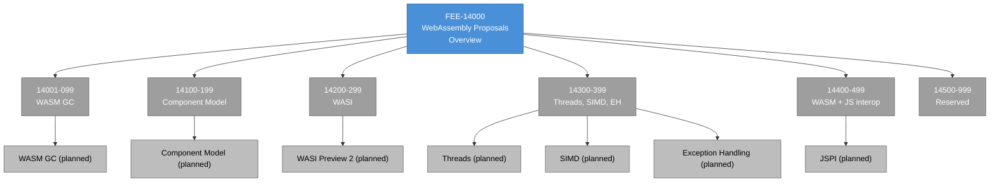

# [FEE-14000] WebAssembly 提案概覽

:::info
WebAssembly 於 2017 年以最小可行執行環境出貨，自此不斷加入語言形狀的功能。每個編譯到 WASM 的工具鏈都是一場關於哪些提案已在目標引擎落地的賭注。
:::

:::warning Web Platform Proposals
10000-19999 範圍內的文章涵蓋尚未在所有主要瀏覽器中穩定的功能。當功能正式穩定後，文章將移至對應的 0-9999 分類。
:::

## 背景

W3C 的 **WebAssembly Community Group**（WebAssembly CG）維護核心 WebAssembly 規範並孵化新提案。**WebAssembly Working Group**（WebAssembly WG）發佈正式的 Recommendation 軌。兩個群組共享成員——每個引擎廠商與許多語言工具鏈團隊都參與兩者——並協調，讓 CG 孵化的提案在成熟時乾淨地轉移到 WG 標準化。不像 TC39 或 WHATWG，治理結構明確分開孵化角色（CG）與推薦角色（WG），這讓早期提案可以在 CG 中存活而不影響 WG Recommendation 的穩定性。

**BytecodeAlliance** 是與 W3C 群組分離但與其深度整合的非營利組織。它託管 WASM 標準的共享實作——Wasmtime（參考執行環境）、Wasmer（替代執行環境）、`wasm-tools`、`cranelift`（Wasmtime 使用的代碼產生器）、以及 `wit-bindgen`（Component Model 的綁定產生器）。Alliance 成員（Mozilla、Intel、Fastly、Red Hat、Microsoft、Amazon 等）貢獻這些專案，它們是瀏覽器之外 WASM 的事實參考實作。Alliance 不擁有規範；它擁有實作。

規範治理（W3C）與實作治理（BytecodeAlliance）的分離在網路平台標準中並不尋常。TC39 沒有等效物——實作 ECMAScript 的引擎團隊直接參與標準組織，沒有託管參考實作的獨立非營利組織。WASM 的分離存在，因為非瀏覽器 WASM 生態系需要一個瀏覽器廠商不適合提供的通用可用、商業友善的參考實作。Alliance 為邊緣運算、無伺服器、外掛生態系填補該角色。

**階段模型**（Phase 0 到 Phase 4）反映 TC39 的階段模型並描述提案的成熟度。Phase 0 是預提案；Phase 0 的提案在設計倉庫的 Issue 追蹤器中追蹤，尚未達到正式 CG 考量。Phase 1 是「功能提案」（CG 同意該問題值得解決）。Phase 2 是「提議規範文字」（在專屬倉庫中有完整規範並帶有 Champion）。Phase 3 是「實作階段」（引擎正在實作並提供回饋）。Phase 4 是「標準化該功能」（WG 把提案合併進核心規範）。當規範文字穩定且實作者同意未來規範變更不太可能時，引擎常不帶 Flag 出貨 Phase 3 提案。

**瀏覽器內 / 瀏覽器外的分工**是本分類的最重要事實。有些 WASM 提案直接瞄準瀏覽器——WASM GC、Threads、SIMD、Exception Handling、JS Promise Integration 只在帶有 JavaScript 互通與瀏覽器出貨考量的脈絡下才有意義。其他提案瞄準非瀏覽器 WASM 執行環境——WASI（WebAssembly System Interface）與 Component Model 為伺服器與邊緣運算環境設計，WASM 在 Wasmtime、Wasmer 或 Spin 內執行。瀏覽器出貨與非瀏覽器出貨是具不同成功標準的分離追蹤考量。

本 FEE 分類涵蓋兩側。文章 14001-14099（WASM GC）與 14300-14399（Threads/SIMD/Exception Handling/JSPI）談瀏覽器——V8、SpiderMonkey、JavaScriptCore 中出貨什麼、它如何與 JavaScript 整合、工具鏈作者能瞄準什麼。文章 14100-14199（Component Model）與 14200-14299（WASI）談執行環境生態系——Wasmtime 與 Wasmer 中出貨什麼、元件連結模型如何運作、WASI 的基於能力系統介面如何組合。從瀏覽器背景來的讀者聚焦第一組；從伺服器或邊緣運算背景來的讀者聚焦第二組。

兩個軌道也有不同的出貨速率特性。瀏覽器側出貨依引擎發佈步調移動（單引擎數週到數月，跨引擎可用性數季）。執行環境側出貨依執行環境維護者的步調移動，對較小功能加入可能更快（Wasmtime 每月出貨），對跨越核心 WASM 表面的提案則更慢（多執行環境協調很重要）。預測採用時間軸的讀者需要理解給定提案在哪個軌道上。

**2017 MVP** 是原始的 WebAssembly 出貨里程碑。它定義四種值型別（`i32`、`i64`、`f32`、`f64`）、線性記憶體、函式、表格，僅此而已。沒有垃圾回收、沒有例外、沒有執行緒、沒有 SIMD。最小表面是刻意選擇：一個所有四個瀏覽器引擎都能快速實作且可互通的小型規範，之後再追加功能。MVP 在 Chrome 57（2017 年 3 月）、Firefox 52（2017 年 3 月）、Safari 11（2017 年 9 月）出貨。Edge 隨後不久跟進。自此每個 MVP 後提案都增量延伸表面，核心規範在達到 Phase 4 時吸收功能。

MVP 的設計也繼承了前驅者的關鍵決定。Mozilla 的 `asm.js`（2013）證明了 JavaScript 的子集能用作 C/C++ 的編譯目標；Google 的 PNaCl（Portable Native Client，2013-2017）證明了可攜式位元組碼格式能以合理的安全保證在瀏覽器中執行原生編譯代碼。WASM 從兩者吸取教訓：二進位格式（從 PNaCl 未成功的位元組碼做法學得）加上緊密的 JavaScript 整合（從 asm.js 在跨瀏覽器採用的成功學得）。結果是業界在首次出貨版就接受的規範——先前的 WASM 替代品都未在首次發佈達成這點。

## 情境

一個團隊出貨以 Kotlin/WASM 寫成的大型應用。Kotlin 的編譯器發出 WASM GC 位元組碼——它倚賴 WASM GC 提案在引擎中原生管理物件配置與垃圾回收，避免在線性記憶體內實作 Kotlin 相容配置器的額外負擔。WASM GC 於 2023-2024 達到 Phase 4 並合併進核心規範。Chromium 在 Chrome 119（2023 年 10 月）不帶 Flag 出貨 WASM GC。Firefox 在 Firefox 120（2023 年 11 月）出貨。Safari 在 Safari 18.2（2024 年 12 月）出貨。到 2025 年，WASM GC 是普遍可用的功能，Kotlin 團隊能把他們的 WASM 輸出自信地送到任何現代瀏覽器。

團隊的自信不延伸到每個想用的 WASM 功能。JSPI（JavaScript Promise Integration）讓 WASM 代碼能像呼叫同步 Kotlin 函式那樣呼叫非同步 JavaScript API，簡化 WASM 與瀏覽器非同步 API（fetch、IndexedDB、Web Animations）的橋接。JSPI 於 2025 年達到 Phase 4，但處於不同的出貨點——在 Chrome 有 Origin Trial、在 Firefox 在偏好設定後、在 Safari 未出貨。團隊不能把 JSPI 相依代碼作為硬性要求出貨；他們要嘛完全避免 JSPI、要嘛用 Polyfill 風格的 promise-to-callback 橋包裝非同步呼叫、要嘛用 Origin Trial 參與把 JSPI 相依代碼只出貨給他們的 Chrome 使用者。

逐提案的出貨狀態因此是任何 WASM 編譯工具鏈使用者每個發佈週期都會執行的重複檢查。落在瀏覽器的 WASM 應用通常是多個提案的組合（GC + Threads + SIMD + 可選的 JSPI），每個提案的出貨狀態分別追蹤。本概覽提供框架，以推理在瀏覽器瞄準與執行環境瞄準工作負載上採用哪些提案何時採用。

團隊的首次執行決策——無條件採用 WASM GC、把 JSPI 延後到逐引擎代碼路徑——代表了 WASM 採用的實務運作方式。每個提案都有自己的出貨檢查與自己的採用決定。生產 WASM 代碼庫逐提案演進：今日部署普遍使用 GC、今日實驗性功能旗標為 Chrome 使用者啟用 JSPI、下一季升級在 Safari 出貨後可能普遍加入 JSPI。做每個決定的框架相同；具體答案隨每個提案決策時的狀態而變。

函式庫作者——例如 WASM 編譯的加密函式庫或 PDF 渲染函式庫的作者——有額外的考量。函式庫編譯後的 WASM 二進位是必須在使用者目標環境執行的部署成品。以 SIMD 啟用編譯的函式庫無法在不支援 SIMD 的較舊瀏覽器上執行；函式庫作者要嘛出貨多個二進位（SIMD 與非 SIMD 變體），配合基於 `wasm-feature-detect` 的執行期選擇，要嘛以保守功能集編譯，能在所有地方執行但把效能留下不用。函式庫作者模式是多二進位出貨加功能偵測，類似於原生函式庫出貨架構特定二進位（x86_64、ARM64 等）並在載入時選擇。

多二進位做法有隨函式庫使用者增長而累積的基礎設施成本。每個二進位變體是分離的成品，需要建置、測試、託管、交付；成品交付本身通常涉及帶有每個功能組合的 cache-control 的 CDN。瞄準廣泛瀏覽器支援的函式庫常出貨 2-4 個變體（無功能、只有 SIMD、SIMD + Threads、完整功能集），把基礎設施成本當作覆蓋使用者族群的代價接受。瞄準較窄受眾的函式庫——例如僅桌面的網頁應用——可能出貨單一以目標受眾普遍支援的功能集編譯的二進位，以覆蓋換取簡化。

## 設計思維

### 為什麼 WASM 先出貨 MVP

2017 年的 MVP 刻意最小化。四個引擎團隊（V8、SpiderMonkey、JavaScriptCore、當時的 ChakraCore）本可以協商出包含 GC、例外、執行緒、SIMD 的較大 v1。他們選擇不這樣做，因為較大的 v1 會讓團隊辯論設計細節而延後出貨多年。最小 MVP 在七個月內跨所有引擎出貨——業界先前未見於新位元組層級語言規範的出貨時間軸。

MVP 後提案源自真實生產經驗。C++ 與 Rust 使用者在數值代碼撞到速度上限時要求 SIMD；當多核擴展成為瓶頸後跟進 Threads。Java、Kotlin、Dart 使用者在實作語言特定 GC 於線性記憶體內被證明使記憶體使用量加倍並在典型配置模式上傷害效能後要求 GC。Swift 使用者因其錯誤模型需要，以及把例外翻譯為 WASM 原始控制流太昂貴，而要求 Exception Handling。每個提案追溯到特定語言社群的生產痛，提案的設計反映該社群的要求。

階段化讓引擎能出貨穩定基礎並增量加入能力，讓工具鏈作者在每個時間點都能瞄準出貨功能集。替代方案——在 v1 一起出貨 GC、EH、Threads、SIMD——會讓 MVP 延後數年、會產生功能間更多互動邊的較大規範、並會因每個功能必須從第一天與其他每個功能運作而讓引擎實作更難。增量做法讓功能獨立穩定，讓引擎團隊依獨立時程出貨。

增量做法也有值得指名的成本。工具鏈必須追蹤哪個提案在哪個引擎哪個階段；矩陣夠大以致自動化工具（`wasm-feature-detect` 函式庫、`wasm-tools` crate 功能）實質上是必要。想使用最新功能的應用必須出貨多個二進位並在載入時選擇。編譯到 WASM 工具鏈的文件常落後提案出貨，採用新功能的團隊發現自己閱讀 GitHub Issue 與引擎發佈筆記作為權威來源，在策展文件追上之前。這些成本是真實的，它們隨 MVP 後提案集增長累積；它們是 CG 接受以保留 MVP 出貨時間軸的取捨。

### 生態系如何彌補時間差

**wasm-bindgen**（Rust）與 **emscripten**（C/C++）是瀏覽器目標兩個主導的編譯到 WASM 工具鏈。兩者都產生膠水代碼，在載入時偵測功能支援並使用適當的二進位。可以出貨多個二進位——一個不帶 SIMD、一個帶 SIMD——載入器基於 `navigator.wasm.simd`（或等效的功能偵測探測）在執行期選擇。膠水代碼也處理 JavaScript 側綁定：把 WASM 函式匯出包裝為型別化 JavaScript 函式、跨 WASM/JS 邊界整理字串與物件、管理 WASM 實例的生命週期。

**`wasm-feature-detect`** 是一個小型 npm 函式庫，透過編譯小型探測模組測試每個提案。函式庫的 API 是 `await simd()` 或 `await threads()`；每個探測編譯一個最小 WASM 模組，運用特定功能並回傳引擎是否接受。這種做法比檢查引擎版本號更可靠，因為它測試實際的執行期能力；版本字串只產生可能落後真實執行期行為的推斷能力。改編為多個 WASM 二進位的生產應用在載入時使用 `wasm-feature-detect` 選擇要取用哪個二進位。

**Fallback 編譯目標。** 當提案未在所有地方出貨時，工具鏈可以發出替代輸出。Kotlin/WASM GC 可以在缺少 WASM GC 的環境中回退到 Kotlin/JS（編譯為 JavaScript）；效能取捨顯著但輸出能執行。Emscripten 可以為早於 WASM 的環境發出 `asm.js`，今日少見但在 2017-2019 常見。Fallback 路徑讓維護負擔加倍（兩條編譯管線、兩個測試矩陣），通常保留給必須支援廣泛環境範圍的專案。

**Origin Trials**（針對瀏覽器出貨的 WASM 提案）讓生產應用在提案達到普遍出貨前對抗出貨引擎測試。撰文時 JSPI 的 Origin Trial 讓瞄準 Chrome 的應用在生產中使用該提案，同時提供塑形最終規範的回饋。Trial Token 是來源範圍且有時限的；參與 Trial 的應用把該功能架構為可選增強，讓 Trial 過期不會破壞產品。

執行環境側提案沒有 Origin Trial 等效物；類似機制是執行環境為實驗標記的預發佈二進位。例如 Wasmtime 在旗標後出貨功能（CLI 上的 `--wasm-features`），當達到 CG 階段與互通測試標準時它們變為預設啟用。早期採用執行環境提案的團隊對抗預發佈 Wasmtime 二進位出貨，並在穩定軌道追上時升級。

### 追蹤一個提案：WASM GC 走過管道

WASM GC 說明 WASM CG 管道。提案於 2017 年作為 MVP 的後續首次討論。早期草圖探索在執行環境中嵌入語言通用 GC，但設計複雜度顯著，CG 在其他 MVP 後功能（SIMD、Threads、EH）先出貨時把提案擱置。

提案於 2020 年以修訂做法達到 Phase 1：一個基於參考型別的 GC，依賴主機的垃圾回收器（在瀏覽器中是 JavaScript 引擎的 GC），而避免向 WASM 執行環境引入獨立 GC。這個設計透過委派給主機繞開 WASM 特定 GC 的複雜度。提案於 2021 年以完整規範移到 Phase 2、於 2022 年以積極引擎實作移到 Phase 3、於 2023-2024 以跨引擎出貨移到 Phase 4。從 Phase 1 到 Phase 4 的總耗時約三年——比原始 MVP 出貨所需更快，因為規範流程已成熟，引擎團隊有實作 MVP 後功能的基礎設施。

Kotlin/WASM 是第一個主要生產編譯到 WASM GC 工具鏈，於 2024 年的 Kotlin 2.0 以 alpha 出貨，並在後續釋出版畢業到 beta。Dart/WASM 跟進，為 Flutter 的網頁輸出瞄準 WASM GC。Java 社群也有追蹤努力（CheerpJ、TeaVM），為編譯 Java 到 WASM 工作負載使用 WASM GC。這是所有編譯到 WASM GC 工具鏈遵循的模式：等 Phase 4 + 跨引擎出貨，然後把 WASM GC 輸出作為主要目標出貨，帶有缺少該功能環境的 fallback 路徑。

WASM GC 的故事也說明 CG 對重大設計轉向的開放性。2017-2019 的初始 GC 做法與最終設計不同；CG 在開發中途暫停提案，並以更乾淨的基於參考型別做法重啟。這種即使在早期設計投入後仍願意轉向——是讓 WASM 提案以高品質出貨的一部分。成本是必須轉向的功能耗時更長；好處是功能在出貨時帶有通過實作者審查的設計，避免了在截止日期壓力下倉促設計造成的 Churn。

### 何時該採用 Phase 4 前 WASM 提案

WASM 採用計算是一組小問題。

第一：**這是瀏覽器提案還是執行環境提案？** 瀏覽器提案（GC、Threads、SIMD、EH、JSPI）有與 CSS 與 HTML 提案相同的逐引擎出貨考量——透過 MDN、caniuse、引擎自己的狀態頁面追蹤。執行環境提案（Component Model、WASI）有不同的追蹤：要檢查的狀態是 Wasmtime、Wasmer、WasmEdge 的實作狀態加上執行環境主機生態系的支援。

第二：**提案是否達到 Phase 3 或之後？** Phase 1 與 Phase 2 的提案有會且確實會改變形狀的規範。Phase 3 的提案規範夠穩定，引擎正在對抗實作；Phase 3 的變更通常是小幅釐清。Phase 4 是 CG 視角下的「完成」。對能忍受小幅修訂的團隊而言，在 Phase 3 採用是合理賭注；在 Phase 2 採用需要緊密跟隨規範迭代。

第三：**團隊使用哪個編譯到 WASM 工具鏈，它支援該提案嗎？** 工具鏈支援落後提案出貨。在所有三個瀏覽器都達 Phase 4 的提案可能仍不被團隊的編譯器支援——例如 Rust 的 `wasm32-unknown-unknown` 目標在特定釋出版加入 WASM GC 支援，在該釋出版前編譯的應用無法使用 GC 功能。團隊與引擎的功能矩陣並列檢查他們工具鏈的功能矩陣。

第四：**二進位大小與啟動成本輪廓是什麼？** WASM 提案可以影響二進位大小（SIMD 代碼每個運算比純量大；GC 引入型別資訊元資料）與啟動成本（JSPI 增加堆疊切換負擔；Threads 需要 SharedArrayBuffer，帶有 HTTP header 要求）。採用決策納入團隊瞄準的效能輪廓，因為有些提案有對特定工作負載重要的取捨。

14001-14499 下的文章為每個具體提案回答這四個問題。本概覽提供框架。

問題的排序很重要。瀏覽器與執行環境放第一決定哪些追蹤來源適用。階段狀態放第二過濾掉太不穩定而無法承諾的提案。工具鏈支援放第三決定團隊是否能發出使用該提案的二進位。效能輪廓放最後校準取捨。跳過第一個問題的團隊發現自己追蹤錯的狀態頁面；跳過第三個問題的團隊太晚發現他們的編譯器無法發出他們想要的功能。

框架的具體應用：一個出貨從 Rust 編譯到 WASM 的影像處理函式庫的團隊。瀏覽器瞄準？是。階段狀態？相關提案（影像 Kernel 的 SIMD、並行批次處理的 Threads、從 Rust panic 點傳播錯誤的 Exception Handling）都是 Phase 4。工具鏈支援？Rust 的 `wasm32-unknown-unknown` 目標在編譯時以功能旗標支援 SIMD；Threads 需要啟用 atomics 的 `wasm32-unknown-unknown` 加上 `-C target-feature=+atomics,+bulk-memory`。效能輪廓？SIMD 在可向量化 Kernel 上使吞吐加倍；Threads 擴展至可用核心數減去跨來源隔離負擔；EH 增加適度二進位大小帶可忽略執行期成本。

決定：無條件採用 SIMD 與 EH（Phase 4 + 普遍出貨）、有條件在跨來源隔離檢查後採用 Threads（功能偵測並在非隔離來源回退到單執行緒）。這產生一個在每個現代瀏覽器出貨、帶可用處選擇性效能改進的函式庫。

## 深入探討

### 跨來源隔離與 SharedArrayBuffer

WASM Threads 需要 SharedArrayBuffer，它是 2018 年 Spectre CPU 漏洞被揭露後部分停用的 JavaScript 功能。現代瀏覽器把 SharedArrayBuffer 閘門在**跨來源隔離**要求後：頁面必須以 `Cross-Origin-Opener-Policy: same-origin` 與 `Cross-Origin-Embedder-Policy: require-corp`（或 `credentialless`）HTTP header 提供服務。這些 header 把瀏覽脈絡與跨來源頁面和跨來源資源隔離，減輕 SharedArrayBuffer 本會暴露的 Spectre 攻擊表面。

對 WASM Threads 採用的實務後果：託管 WASM 應用的網站必須配置跨來源隔離 header。嵌入第三方內容（廣告網路、分析腳本、嵌入影片）的網站可能發現跨來源隔離與既有整合不相容——每個跨來源資源必須要嘛選擇加入可嵌入性（`Cross-Origin-Resource-Policy: cross-origin`），要嘛使用 `credentialless` 模式，這本身有相容性含義。無法配置跨來源隔離的網站無法使用 WASM Threads。

這項基礎設施要求讓 WASM Threads 有別於其他 WASM 提案。GC、SIMD、EH、JSPI 沒有 header 要求；Threads 有可能是重要採用障礙的 header 要求。計畫使用 WASM Threads 的團隊應在承諾該功能前驗證託管環境支援該 header。

對需要 Threads 但無法網站範圍配置跨來源隔離的應用，有較窄的逃脫機制：**credentialless** COEP 模式為跨來源子資源放寬加入要求，代價是把憑證從那些請求排除。這對不需要身分驗證的靜態資產（腳本、影像）有效但不適合需要 Cookie 或其他憑證的跨來源 API 呼叫。有混合要求的團隊常為 Threads 相依應用切出專屬來源，在該來源上接受跨來源隔離要求，同時主來源不帶它。

### Component Model 與 WIT

Component Model 是瞄準非瀏覽器執行環境的重大 MVP 後提案。其目標是讓 WASM 模組乾淨組合——以一種語言（Rust、C、Python、Go）寫的 WASM 元件能與另一種語言寫的元件連結，帶有描述它們之間介面的 IDL（WIT——WebAssembly Interface Types）。Component Model 是 WASI Preview 2 的基礎，後者把標準系統介面（檔案系統、網路、HTTP）定義為 WIT 介面。

WIT 是一個小型介面定義語言。它描述型別（record、variant、list、option、result）與函式，Component Model 工具鏈（`wit-bindgen`）從 WIT 介面產生語言特定綁定。匯入 `wasi:filesystem` 介面的 Rust 元件能與任何提供該介面的 WASI Preview 2 主機連結，不需要知道主機的實作細節。這類似於 Windows 上的 COM 或 1990 年代的 CORBA 如何結構化跨語言連結——WASM CG 在設計 Component Model 時研究的教訓。

對採用的實務後果：Component Model 是重大能力但優先瞄準非瀏覽器執行環境。瀏覽器尚未有 Component Model 匯入的原生支援；今日在瀏覽器執行的元件透過模擬連結行為的 Component-Model 感知載入器運作。執行環境（Wasmtime、WasmEdge、Spin）有一級支援。建構邊緣運算或無伺服器工作負載的團隊受益最多；瞄準瀏覽器的團隊把 Component Model 視為未來路徑。

Component Model 採用有額外的成本：工具鏈必須支援元件格式，需要與核心 WASM 工具鏈不同的工具。Rust 的 `cargo component` 包裝 Cargo 以做元件輸出；JCO（JavaScript Component Tools）包裝 JavaScript 做元件產生；jco-transpile 把元件轉換為網頁相容形式。這些工具各自由小團隊維護，在穩定性上可能落後核心 WASM 生態系。採用 Component Model 的團隊應為工具成熟度編列預算並預期與核心 WASM 工具鏈比較有較粗糙邊緣。

### WASI Preview 2 與基於能力的模型

WASI（WebAssembly System Interface）是 WASM 元件如何與主機系統互動的規範——讀取檔案、發起網路請求、處理環境變數。2024 年出貨的 WASI Preview 2 把更早的 WASI Preview 1 圍繞 Component Model 重構，並引入基於能力的安全模型：WASM 元件無法存取未明確授權存取的系統資源。

基於能力的模型是從 POSIX 風格的環境權威（OS 允許時任何行程都能呼叫 `open("/etc/passwd")`）的出發。想讀取檔案的 WASI Preview 2 元件必須以特定路徑預開啟的檔案系統 handle 被呼叫；嘗試開啟該 handle 之外的路徑會失敗。這讓 WASI 元件預設更安全——元件無法意外地透過讀取未預期的檔案洩漏資料——並讓主機執行環境透過 handle 範圍執行安全政策。

取捨是基於能力的組合比環境權威更複雜。撰寫 WASI 應用的團隊必須思考授予哪些能力、如何範圍化它們、如何跨連結元件組合能力。執行環境工具（Wasmtime 的 `--dir` 旗標、Spin 的元件清單）讓典型使用案例可管理，但複雜部署需要原生 OS 開發不需要的能力設計思維。

WASI Preview 2 的介面集刻意保守。Preview 2 出貨集涵蓋檔案系統、網路（TCP socket、UDP socket）、HTTP、基本行程控制。它不涵蓋 GUI 基本元素、圖形 API、或硬體特定介面。未來 WASI 迭代可能加入這些；目前，需要超出 Preview 2 集合能力的任何 WASI 應用必須倚賴執行環境特定擴充或離開 WASI 模型。這是 WASI 子群組的刻意保守姿態——目標是穩定的跨執行環境介面，穩定需要範疇克制。

### WASM 文字格式與編譯管道

WASM 有二進位格式（`.wasm`）與人類可讀的文字格式（`.wat`）。文字格式用於除錯、小型手寫範例、規範參考；二進位格式是生產中出貨的。編譯器直接發出二進位；`wasm-tools` 能在兩者間轉換以做檢查。

編譯到 WASM 語言的編譯管道有數個階段。來源語言（Rust、C++、Kotlin）編譯為中間表示（Rust/C++/Swift 用 LLVM IR、Kotlin 用 Kotlin 的 IR）。WASM 瞄準後端接著發出二進位 WASM 模組。`wasm-opt`（來自 Binaryen 工具組）對二進位做後處理，最佳化大小與執行期效能。最終二進位是瀏覽器或執行環境載入的。

採用 WASM 的團隊應理解此管道，因為效能分析常揭示特定階段的問題。撰寫次佳的 shader 花費執行期效能；編譯器發出次佳 WASM 花費二進位大小；`wasm-opt` 配置與目標環境不匹配花費大小或速度之一。除錯效能問題需要知道是哪個階段引入它們。

### 瀏覽器 WASM 功能的畢業期望

瀏覽器瞄準的 WASM 提案在跨 Chromium、Firefox、Safari 不帶 Flag 出貨時畢業到 `Browser APIs & Web Platform`（400-499）。WASM GC、Threads、SIMD、Exception Handling 在撰文時都過此門檻，是畢業候選。JSPI 處於 Phase 4 但在較少引擎出貨；它留在 14000 範圍直到跨引擎出貨完成。

FEE 的 WASM 提案畢業決策也納入工具鏈採用。普遍出貨但沒有生產就緒工具鏈支援的提案實際觸及有限；查閱 FEE 的讀者需要能實際使用該功能，不只是知道它。畢業時的編輯性檢查是：至少有一個主要編譯到 WASM 工具鏈（wasm-bindgen、emscripten、Kotlin/WASM、Dart/WASM）發出使用此功能的代碼嗎？如果是，畢業合適；如果不是，文章留在 14000 範圍直到工具鏈採用追上。

只執行環境的提案（Component Model、WASI）不畢業到瀏覽器分類。它們留在 14000 作為伺服器側 WASM 內容的穩定歸屬。若未來加入伺服器執行環境關切（邊緣運算、無伺服器 WASM、基於 WASI 的沙盒）的 FEE 分類，那些文章可以搬到那裡；目前 14100-14299 是它們的家。

部分畢業模式在此也適用。WASM GC 能依自己的時程畢業，即便 JSPI 仍在出貨；SIMD 獨立於 Threads 畢業。每個提案個別追蹤與畢業，這匹配 CG 本身結構化提案集的方式——每個提案獨立，畢業尊重該獨立性。

### `wasm-pack` 與 `wasm-bindgen` 開發者體驗

對於 Rust 到瀏覽器 WASM 工作流程，`wasm-pack` 是建置、最佳化、發佈 WASM 套件到 npm 或網頁伺服器的包裝工具。`wasm-bindgen` 是較底層函式庫，為 Rust 函式產生 JavaScript 膠水代碼，從 Rust 側型別產生型別化 JS 匯出。它們共同形成典範的 Rust 到瀏覽器管道。

開發者體驗接近標準 Rust 開發：`cargo build --target wasm32-unknown-unknown` 產生原始 WASM 二進位、`wasm-bindgen` 把它後處理為套件、`wasm-pack publish` 上傳套件到 npm。應用以標準 npm 相依消費套件，把 Rust 函式當作 JavaScript 函式呼叫。效能關鍵路徑移到 Rust；應用膠水留在 JavaScript。

其他語言有類似的開發者體驗：C/C++ 的 `emscripten`、Go 的 `syscall/js` 套件、.NET 的 `dotnet-wasm`。開發者體驗在成熟度上不同——Rust 的最精緻、Go 的在改進、.NET 的在追上。開始編譯到 WASM 專案的團隊通常部分為了開發者體驗品質選擇來源語言。

## 圖解

藍色節點是分類概覽。灰色範圍節點目前沒有已起草的子文章；規劃主題以灰色葉節點顯示。14000 範圍的子文章是 FEE 專案後續規格的範疇——在那些子文章存在之前，本概覽是入口。追蹤特定主題的讀者應使用參考資料區段的 WebAssembly CG、BytecodeAlliance、以及實作追蹤器的連結，直到對應子文章起草為止。

子文章存在時的建議閱讀順序：瀏覽器瞄準讀者先看 WASM GC（最成熟、最大語言社群採用）、然後 Threads + SIMD + EH 作為效能聚焦瀏覽器三劍客、然後 JSPI 處理非同步互通、最後執行環境瞄準的 Component Model 與 WASI 作為分離弧。從編譯到 WASM 工具鏈背景來的讀者可以直接跳到他們工具鏈支援的提案。從伺服器執行環境背景來的讀者聚焦 Component Model 與 WASI 子文章並完全跳過瀏覽器出貨內容。

瀏覽器側與執行環境側弧有不同的學習曲線。瀏覽器側 WASM 通常是單一應用二進位的建置配置考量；學習是編譯器旗標選擇與功能偵測模式。執行環境側 WASM 是影響整個應用部署模型的架構考量；學習包含能力設計、元件組合、主機整合模型。新接觸 WASM 的讀者應預期瀏覽器側在生產力時間上先到，執行環境側採用在應用部署模型要求時跟隨。

## 此範圍的軌道

| 範圍 | 主題 | 範例提案 |
|------|------|---------|
| 14001-14099 | WASM GC（參考型別的垃圾回收） | GC 基礎、非空參考、型別等式 |
| 14100-14199 | Component Model | WIT 介面定義、`wit-bindgen`、元件組合 |
| 14200-14299 | WASI（WebAssembly System Interface） | WASI Preview 2、檔案系統、HTTP、Socket |
| 14300-14399 | Threads、SIMD、Exception Handling | SharedArrayBuffer 整合、Atomics、SIMD Opcode、基於 Tag 的例外 |
| 14400-14499 | WASM + JS 互通 | JS Promise Integration、Type Reflection、匯出記憶體模式 |
| 14500-14999 | 保留 | — |

範圍指派反映提案分組與面向讀者的分類。WASM GC 有自己的範圍，因為它跨越語言支援邊界值得專屬處理；Threads/SIMD/EH 共享範圍，因為它們是效能聚焦的瀏覽器三劍客。Component Model 與 WASI 分開，因為它們瞄準非瀏覽器執行環境並有不同追蹤考量。

未來範圍指派可能隨新提案落地而浮現。Memory64（支援 64 位元線性記憶體定址）在達到 Phase 4 並出貨時是獨立範圍的候選；Tail Call 提案類似地在關心它的編譯到 WASM 工具鏈（函數式語言編譯器）正當化專屬處理時可能贏得自己的子範圍。14500-14999 保留範圍容納這些未來加入。

## 畢業機制

瀏覽器出貨提案（WASM GC、Threads、SIMD、EH、JSPI）在跨 Chromium、Firefox、Safari 不帶 Flag 出貨時畢業到 `Browser APIs & Web Platform`（400-499）。WASM GC 過此門檻且為近期畢業候選。Threads 已跨引擎出貨但被跨來源隔離要求閘門化，影響團隊如何採用；畢業決策可能等採用模式穩定後。SIMD 與 EH 普遍出貨且也是近期候選。

只執行環境的提案（Component Model、WASI）不畢業到瀏覽器分類。它們留在 14000 作為伺服器側 WASM 內容的穩定歸屬。若未來加入伺服器執行環境關切的 FEE 分類，那些文章可以搬到那裡；決定會在分類加入時發生。

在這類分類存在之前，14100-14299 範圍充當執行環境側 WASM 內容的事實歸屬。這有把所有 WASM 內容——瀏覽器與執行環境——留在單一頂層分類的效果，簡化不熟悉雙軌結構的讀者的發現。缺點是只對瀏覽器 WASM 感興趣的讀者必須捲過他們不需要的執行環境內容。

當瀏覽器瞄準提案的對應文章畢業時，搬到 400-499 範圍的新 ID，舊的 14000 段 ID 變成重新導向。反向連結、Git 歷史、書籤都保持完整。

FEE 不正式追蹤哪些功能接近畢業，因為 WebAssembly CG 的階段追蹤器是更精確的答案。好奇畢業候選的讀者應查 `github.com/WebAssembly/proposals` 取得當前階段狀態，加上引擎的 WASM 實作追蹤器（V8 的 WASM 狀態、SpiderMonkey 的 WASM 功能旗標、JavaScriptCore 的 Safari 發佈筆記）。

## 相關 FEE

| FEE | 關聯 |
|-----|------|
| [FEE-400 Browser APIs & Web Platform](../../Browser%20APIs%20and%20Web%20Platform/400.md) | 畢業的瀏覽器出貨 WASM 提案的目的地分類。 |
| [FEE-405 Web Workers & Concurrency](../../Browser%20APIs%20and%20Web%20Platform/405.md) | WASM Threads 需要基於 Worker 的架構與 SharedArrayBuffer 理解；FEE-405 是多執行緒 WASM 模式的前置條件。 |
| [FEE-417 Transferable Objects](../../Browser%20APIs%20and%20Web%20Platform/417.md) | 在主執行緒與託管 WASM 的 Worker 間傳輸資料涉及 Transferable 物件語意。 |
| [FEE-13000 Browser Compute](../Browser%20Compute/13000.md) | 姊妹軌道——WASM 是 WebGPU 工作負載的 fallback 運算執行環境，WebGPU+WASM 整合是共享主題。 |
| [FEE-10000 TC39 & JS Proposals](../TC39%20and%20JS%20Proposals/10000.md) | 姊妹軌道——JSPI 專門橋接 WASM 與 TC39 提案涵蓋的 JS 非同步模型。 |
| [FEE-11000 CSS Experimental](../CSS%20Experimental/11000.md) | CSS 提案的姊妹軌道；治理與流程不同。 |

## 參考資料

- [WebAssembly Community Group](https://www.w3.org/community/webassembly/) — 孵化 WASM 提案的 W3C CG。
- [WebAssembly Working Group](https://www.w3.org/wasm/) — 發佈正式 Recommendation 的 W3C WG。
- [WebAssembly Phases Document](https://github.com/WebAssembly/meetings/blob/main/process/phases.md) — Phase 0 到 Phase 4 的權威定義。
- [WebAssembly/proposals on GitHub](https://github.com/WebAssembly/proposals) — 每個活躍 WASM 提案的中央追蹤器，含當前階段與 Champion。
- [WebAssembly/spec](https://github.com/WebAssembly/spec) — 核心規範倉庫。
- [WebAssembly Core Specification](https://www.w3.org/TR/wasm-core-2/) — WebAssembly Core 2 的正式 W3C Recommendation。
- [BytecodeAlliance](https://bytecodealliance.org/) — 主要非瀏覽器 WASM 執行環境背後的非營利組織。
- [Wasmtime](https://wasmtime.dev/) — BytecodeAlliance 的參考 WASM 執行環境。
- [Wasmer](https://wasmer.io/) — 具多主機語言嵌入的替代 WASM 執行環境。
- [WASI project](https://github.com/WebAssembly/WASI) — WebAssembly System Interface 規範。
- [Component Model](https://github.com/WebAssembly/component-model) — Component Model 規範與工具。
- [`wasm-feature-detect`](https://www.npmjs.com/package/wasm-feature-detect) — 執行期 WASM 功能偵測的 npm 函式庫。
- [MDN: WebAssembly](https://developer.mozilla.org/en-US/docs/WebAssembly) — 瀏覽器側 WASM 的典範參考。
- [wasm-bindgen (Rust)](https://rustwasm.github.io/wasm-bindgen/) — Rust 編譯到瀏覽器 WASM 的工具鏈，具 JS 互通。
- [emscripten (C/C++)](https://emscripten.org/) — C/C++ 編譯到 WASM 的工具鏈。
- [Kotlin/WASM documentation](https://kotlinlang.org/docs/wasm-overview.html) — Kotlin 的 WASM GC 目標。
- [WebAssembly Weekly](https://wasmweekly.news/) — 涵蓋 WASM CG 與生態系的電子報。
- [BytecodeAlliance Zulip](https://bytecodealliance.zulipchat.com/) — WASM CG 參與者與實作者的主要聊天場所。
- [wit-bindgen](https://github.com/bytecodealliance/wit-bindgen) — Component Model 介面的綁定產生器。
- [Spin](https://github.com/fermyon/spin) — 來自 Fermyon 的開發者面向 Component Model 執行環境。
- [WasmEdge](https://wasmedge.org/) — 另一個聚焦邊緣運算的 WASM 執行環境。
- [WebAssembly Implementation Status](https://webassembly.org/features/) — 社群維護的逐引擎功能支援頁面。
- [V8 WebAssembly features](https://v8.dev/features) — Chromium V8 引擎關於 WASM 功能出貨的運行筆記。
- [SpiderMonkey WebAssembly status](https://spidermonkey.dev/) — Firefox SpiderMonkey 引擎關於 WASM 實作的筆記。
- [Dart/WASM documentation](https://dart.dev/web/wasm) — Dart 編譯到 WASM 目標的文件。
- [Apple WebKit WebAssembly](https://webkit.org/blog/search/webassembly/) — WebKit 部落格關於 Safari 中 WebAssembly 進度的條目。
- [WebAssembly Summit proceedings](https://webassembly-summit.org/) — 年度社群會議，具實作者與工具鏈作者演講。
- [CHERI and WASM capability research](https://www.cl.cam.ac.uk/research/security/ctsrd/cheri/) — 與 Component Model 相關的基於能力安全學術研究。
- [wasi-libc](https://github.com/WebAssembly/wasi-libc) — 瞄準 WASI 的 C/C++ 代碼的 C 函式庫實作。
- [Spec interpreter (reference)](https://github.com/WebAssembly/spec/tree/main/interpreter) — 官方 WASM 參考直譯器，對規範合規除錯有用。
- [wasmCloud](https://wasmcloud.com/) — 建立於 Component Model 的分散式應用平台。
- [Extism](https://extism.org/) — 利用 WASM 元件的外掛框架，為語言無關的延伸性。
- [Fermyon cloud](https://www.fermyon.com/) — 建立於 Spin 與 Component Model 的無伺服器平台。
- [Cloudflare Workers WASM](https://blog.cloudflare.com/workers-brings-webassembly/) — Cloudflare WASM 瞄準的 Worker 執行環境文件。
- [Proxy-WASM](https://github.com/proxy-wasm/spec) — 基於 WASM 的 proxy filter 規範，用於 Envoy 與 Istio。
- [Shopify Functions](https://shopify.dev/docs/apps/functions) — Shopify 使用 Component Model 的基於 WASM 延伸性框架。
- [wasmCon proceedings](https://wasmcon.io/) — 年度 WebAssembly 會議存檔。
- [WebAssembly abstract machine](https://webassembly.github.io/spec/core/) — WASM 語意中使用的正式機器狀態規範。
- [Mozilla WASM docs](https://developer.mozilla.org/en-US/docs/WebAssembly/Reference) — 逐指令參考文件。
- [WebAssembly WG Recommendations](https://www.w3.org/TR/?tag=webassembly) — 已發佈的 WG Recommendation 文件。
